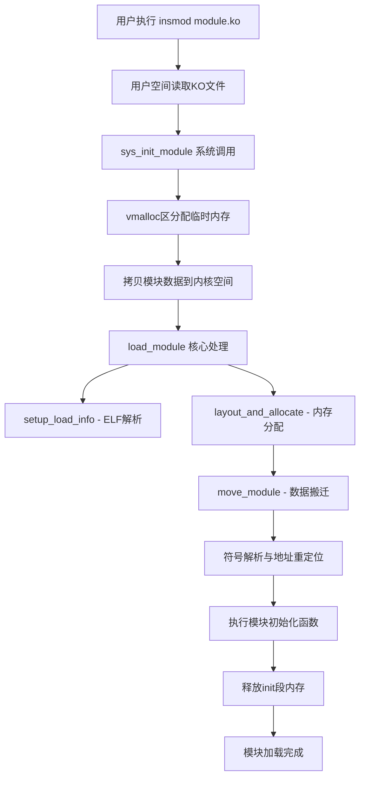
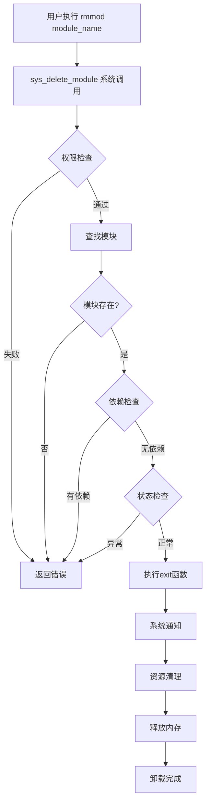
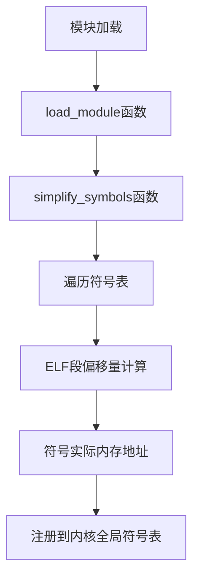
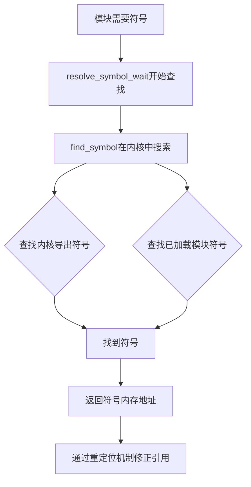

# Linux内核模块工作机制详解

## 📋 目录导航

- [🏗️ 工作机制概述](https://claude-node1.chatshare.biz/chat/b771c2b6-50a3-4c66-b790-819ff9205476#%F0%9F%8F%97%EF%B8%8F-%E5%B7%A5%E4%BD%9C%E6%9C%BA%E5%88%B6%E6%A6%82%E8%BF%B0)
- [📦 KO文件格式详解](https://claude-node1.chatshare.biz/chat/b771c2b6-50a3-4c66-b790-819ff9205476#%F0%9F%93%A6-ko%E6%96%87%E4%BB%B6%E6%A0%BC%E5%BC%8F%E8%AF%A6%E8%A7%A3)
- [🔄 模块加载流程](https://claude-node1.chatshare.biz/chat/b771c2b6-50a3-4c66-b790-819ff9205476#%F0%9F%94%84-%E6%A8%A1%E5%9D%97%E5%8A%A0%E8%BD%BD%E6%B5%81%E7%A8%8B)
- [🗑️ 模块卸载流程](https://claude-node1.chatshare.biz/chat/b771c2b6-50a3-4c66-b790-819ff9205476#%F0%9F%97%91%EF%B8%8F-%E6%A8%A1%E5%9D%97%E5%8D%B8%E8%BD%BD%E6%B5%81%E7%A8%8B)
- [🔗 符号导出机制](https://claude-node1.chatshare.biz/chat/b771c2b6-50a3-4c66-b790-819ff9205476#%F0%9F%94%97-%E7%AC%A6%E5%8F%B7%E5%AF%BC%E5%87%BA%E6%9C%BA%E5%88%B6)
- [🛠️ 实用工具与命令](https://claude-node1.chatshare.biz/chat/b771c2b6-50a3-4c66-b790-819ff9205476#%F0%9F%9B%A0%EF%B8%8F-%E5%AE%9E%E7%94%A8%E5%B7%A5%E5%85%B7%E4%B8%8E%E5%91%BD%E4%BB%A4)

---

## 🏗️ 工作机制概述

编写的内核模块经过编译后，最终形成以`.ko`为后缀的ELF文件。我们可以使用`file`命令来查看它的基本信息：


### 🤔 核心问题

**这样的文件是如何被内核一步一步获取并正常工作的呢？**

为了回答这个问题，我们需要：

1. 📖 学习ELF文件格式，了解KO文件的本质
2. 🔍 深入内核源码，探究模块加载/卸载和符号导出的完整过程

---

## 📦 KO文件格式详解

### 🎯 基本概念

**KO文件（Kernel Object）** 是Linux内核模块的标准文件格式，其本质是一个符合**ELF（Executable and Linking Format）** 标准的**可重定位目标文件（Relocatable Object File）**。

> 💡 **特点**：包含代码和数据，可被链接成可执行文件或共享目标文件，静态链接库也属于这一类。

### 🏗️ ELF文件结构

ELF文件格式的典型布局如下：


### 📊 核心组件详解

#### 1️⃣ ELF头部（ELF Header）

位于文件起始位置，描述整个ELF文件的基本信息：

|字段|说明|值/作用|
|---|---|---|
|`e_type`|文件类型|`ET_REL`（可重定位文件）|
|`e_machine`|目标架构|x86、ARM等|
|`e_shoff`|节区头部表偏移|指向Section Header Table|
|`e_shnum`|节区数量|节区头部表中的条目数|
|`e_shentsize`|节区头部大小|每个头部表项的字节数|
|`e_flags`|处理器标志|通常与内核模块无关|

**🔧 查看命令**：

```bash
readelf -h <ko_file>
```


#### 2️⃣ 程序头部表（Program Header Table）

- ⚠️ 对于可重定位目标文件（如KO文件），程序头部表通常为**空或无效**
- 🎯 主要用于可执行文件或共享库（如.so）
- 📌 内核模块加载时，由内核的模块加载器解析**节区头部表**，而非程序头部表

#### 3️⃣ 节区头部表（Section Header Table）

这是**KO文件的核心结构**，定义了各个节区（Section）的属性。

**🔧 查看命令**：

```bash
readelf -S <ko_file>
```

##### 🏢 代码与数据节区

|节区|内容|说明|
|---|---|---|
|`.text`|主要执行代码|init_module和exit_module函数|
|`.data`|已初始化全局变量|运行时需要的初始数据|
|`.rodata`|只读数据|字符串常量等|
|`.bss`|未初始化全局变量|实际不占文件空间|

##### 📋 模块元信息节区

- **`.modinfo`**：存储模块的元信息（作者、许可证、依赖模块等）

**🔧 查看命令**：

```bash
modinfo <ko_file>
```


##### 🔗 符号与重定位节区（重要）

|节区|作用|重要性|
|---|---|---|
|`.symtab`|符号表|📕 记录导出符号和外部符号引用|
|`.strtab`|字符串表|📕 存储符号名称、节区名称|
|`.rel.*.text/.data`|重定位表|📕 记录需要动态修正的地址偏移|

##### ✅ 版本校验节区

- **`__versions`**：内核版本校验信息，确保模块兼容当前内核的符号版本（CRC校验值）

##### 🔄 模块生命周期节区

|节区|时机|说明|
|---|---|---|
|`.init.text`|模块加载时|执行module_init宏定义的函数|
|`.exit.text`|模块卸载时|执行module_exit宏定义的函数|

##### 🏛️ 模块结构体节区

- **`.gnu.linkonce.this_module`**：存储`struct module`结构体实例，描述模块的完整元信息

### 🚀 KO文件的特殊机制

#### 🎯 动态重定位

- 内核加载时根据重定位表（`.rel.*`）修正代码和数据中的地址
- 依赖`EXPORT_SYMBOL`导出的内核符号表完成符号解析

#### 🔐 版本控制

- 通过`__versions`节区校验符号的CRC值
- 防止模块与不兼容的内核版本一起运行

#### 📦 依赖管理

- `.modinfo`中的`depends=`字段声明依赖的其他模块
- 内核按需自动加载依赖项

### 🛠️ 分析工具使用

```bash
# 查看ELF头部
readelf -h example.ko

# 查看节区头部表
readelf -S example.ko

# 查看符号表
readelf -s example.ko

# 查看重定位表
readelf -r example.ko

# 查看模块信息
modinfo example.ko
```

---

## 🔄 模块加载流程

前面了解了KO内核模块文件的格式内容后，可以知道**内核模块其实就是一段经过特殊加工的代码**，内核可以利用加工后留在内核模块中的信息，对内核模块进行利用。

### 📋 加载流程总览



### 🔍 详细步骤解析

#### 1️⃣ 用户空间操作

当终端执行`insmod module.ko`命令时：

- 🔖 内核模块文件(.ko)通过文件系统被**读取到用户空间内存**中
- 🔧 用户空间程序准备调用系统调用`sys_init_module()`

#### 2️⃣ 系统调用入口

`sys_init_module()`是内核模块加载的入口点：

|操作|说明|
|---|---|
|🔐 权限检查|通过`may_init_module()`检查进程权限|
|💾 内存分配|在`vmalloc区`分配与.ko文件相同大小的内存|
|📋 数据拷贝|将用户空间模块数据拷贝到内核空间|
|🎯 指针设置|`info->hdr`直接指向空间首地址（ELF header）|


**📍 相关函数位置**：`内核源码/kernel/module.c`


#### 3️⃣ 核心加载过程 - load_module()

主要分为两个关键步骤：

##### 🔍 setup_load_info()

|步骤|操作|说明|
|---|---|---|
|1|**解析ELF头**|读取模块的ELF头部信息|
|2|**重定位节区头**|将section地址修改为当前模块在内存中的地址|
|3|**获取字符串表**|通过ELF头索引(e_shstrndx)找到节区名称字符串表|

> 💡 **地址计算公式**： section地址 = e_shstrndx获取的节区头部字符串表标号 + ELF文件起始地址

##### 🏗️ layout_and_allocate()

|步骤|操作|说明|
|---|---|---|
|1|**节区分类**|将所有节区分为init段和core段|
|2|**布局规划**|为两类节区在最终运行地址空间分配内存|
|3|**模块搬运**|`move_module()`将模块从临时缓冲区移动到最终位置|

**📊 节区分类说明**：

|类型|内容|生命周期|
|---|---|---|
|**init段**|模块初始化代码和数据|加载完成后释放|
|**core段**|模块运行时核心代码和数据|一直保留|

#### 4️⃣ 地址重定位

- 🔍 **符号解析**：解决模块对外部符号的引用（如调用内核函数）
- 🎯 **地址修正**：调整模块内部的所有地址引用，指向正确位置

#### 5️⃣ 初始化和清理

- ▶️ **执行init函数**：调用模块的初始化函数（module_init()宏定义的函数）
- 🗑️ **释放init段**：初始化完成后，init段占用的内存被释放，只保留core段

### 💾 内存管理要点

|内存区域|用途|生命周期|
|---|---|---|
|**vmalloc区**|临时存储模块镜像|加载完成后释放|
|**modules区**|模块最终运行区域|core段长期驻留|
|**init段**|初始化代码和数据|初始化完成后释放|

> 🎯 **设计优势**：最大限度节省内核内存使用，及时释放不再需要的初始化代码和数据

---

## 🗑️ 模块卸载流程

卸载过程相对简单，当用户输入`rmmod module_name`命令后，系统通过系统调用`sys_delete_module()`实现。

### 📍 函数定位


### 🔄 卸载流程图



### 🔍 详细卸载步骤

#### 1️⃣ 用户空间操作

```bash
rmmod module_name
```

- 📞 通过系统调用接口调用`sys_delete_module()`
- 📤 将模块名称从用户空间传递到内核空间

#### 2️⃣ 权限与状态检查

```c
// 权限检查
if (!capable(CAP_SYS_MODULE) || modules_disabled)
    return -EPERM;

// 获取模块名称  
if (strncpy_from_user(name, name_user, MODULE_NAME_LEN-1) < 0)
    return -EFAULT;
```

|检查项|说明|
|---|---|
|**能力检查**|确认进程有`CAP_SYS_MODULE`权限|
|**模块状态**|确认内核没有禁用模块功能|
|**名称验证**|安全地复制模块名称到内核空间|

#### 3️⃣ 模块查找与验证

```c
// 获取模块互斥锁
mutex_lock_interruptible(&module_mutex);

// 查找模块
mod = find_module(name);
if (!mod) {
    ret = -ENOENT;  // 模块不存在
    goto out;
}
```

- 🔒 **互斥锁保护**：防止并发修改模块列表
- 🔍 **模块查找**：在内核模块列表中找到对应模块结构体

#### 4️⃣ 依赖关系检查

```c
if (!list_empty(&mod->source_list)) {
    ret = -EWOULDBLOCK;  // 存在依赖模块
    goto out;
}
```

- 🔗 **依赖检测**：检查是否有其他模块依赖当前模块
- ⚠️ **错误处理**：存在依赖则拒绝卸载（除非强制）

#### 5️⃣ 模块状态验证

```c
if (mod->state != MODULE_STATE_LIVE) {
    ret = -EBUSY;  // 模块不处于活跃状态
    goto out;
}
```

确认模块处于`MODULE_STATE_LIVE`（正常运行）状态

#### 6️⃣ 退出函数检查

```c
if (mod->init && !mod->exit) {
    forced = try_force_unload(flags);
    if (!forced) {
        ret = -EBUSY;  // 不能强制卸载
        goto out;
    }
}
```

- ✅ **exit函数检查**：确认模块定义了退出函数
- 💪 **强制卸载**：某些模块可能需要强制卸载（`-f`标志）

#### 7️⃣ 停止模块运行

```c
ret = try_stop_module(mod, flags, &forced);
if (ret != 0)
    goto out;
```

- 🔢 **引用计数检查**：确保没有其他代码正在使用该模块
- 🚫 **禁用模块**：将模块标记为正在卸载状态

#### 8️⃣ 执行清理操作

```c
// 释放互斥锁允许其他操作
mutex_unlock(&module_mutex);

// 1. 调用模块的exit函数
if (mod->exit != NULL)
    mod->exit();

// 2. 通知系统其他部分
blocking_notifier_call_chain(&module_notify_list, MODULE_STATE_GOING, mod);

// 3. 内核实时补丁系统通知
klp_module_going(mod);

// 4. 释放ftrace相关资源
ftrace_release_mod(mod);

// 5. 等待异步调用完成
async_synchronize_full();

// 6. 记录最后卸载的模块名
strlcpy(last_unloaded_module, mod->name, sizeof(last_unloaded_module));

// 7. 最终释放模块资源
free_module(mod);
```

### 📋 清理步骤详解

|步骤|操作|说明|
|---|---|---|
|1|调用exit函数|执行模块定义的清理代码|
|2|系统通知|告知所有监听者模块即将卸载|
|3|实时补丁处理|内核实时补丁系统的特殊处理|
|4|跟踪系统清理|释放ftrace相关资源|
|5|异步操作同步|等待所有异步操作完成|
|6|记录信息|记录最后卸载的模块名用于诊断|
|7|资源释放|释放模块占用的所有内存和资源|

#### 9️⃣ 错误处理

```c
out:
    mutex_unlock(&module_mutex);
    return ret;
```

- 🔓 **释放锁**：确保互斥锁被正确释放
- 📤 **返回错误**：向用户空间返回适当的错误代码

---

## 🔗 符号导出机制

### 🎯 什么是符号？

**符号**是内核模块中通过`EXPORT_SYMBOL`宏声明的**函数和变量**，相当于模块对外提供的接口：

- 📋 **记录位置**：模块加载时，符号被记录到内核的公共符号表中
- 🔗 **共享资源**：成为其他模块可以访问的共享资源
- 🌐 **内核连接**：使用`insmod`加载模块后，模块被连接到内核，可以访问内核的公用符号

### 🤔 为什么需要导出符号？

|需求|说明|示例|
|---|---|---|
|**模块间协作**|允许不同模块互相调用函数和共享数据|网络协议栈模块间调用|
|**分层架构**|支持模块的层级依赖关系|USB驱动依赖usbcore模块|
|**代码复用**|避免重复实现相同功能|多个驱动使用同一个库函数|
|**动态扩展**|保持内核核心精简，通过模块扩展功能|文件系统模块化|

### 📝 符号的导出方式

```c
// 标准导出（所有模块可用）
EXPORT_SYMBOL(function_name);

// GPL协议限制导出（仅GPL兼容模块可用） 
EXPORT_SYMBOL_GPL(function_name);
```

> ⚠️ **使用规则**：
> 
> - 必须在**全局作用域**导出，不能在函数内部使用
> - `_GPL`版本会进行**许可证检查**

### 🏗️ 符号的存储结构

导出的符号会被编译到ELF文件的特殊段中：

|段名|内容|说明|
|---|---|---|
|`__ksymtab`|`kernel_symbol`结构体|符号的核心信息|
|`__ksymtab_strings`|符号名称字符串|符号名称的实际存储|

**kernel_symbol结构体**：

```c
struct kernel_symbol {
    unsigned long value;  // 符号在内存中的地址
    const char *name;     // 符号名称
};
```

### 🔄 符号的加载过程



|步骤|操作|说明|
|---|---|---|
|**模块加载时**|调用`load_module()`中的`simplify_symbols()`|处理（遍历）符号表|
|**地址解析**|根据ELF段偏移量计算符号实际内存地址|st_shndx + st_value = 真正地址|
|**注册符号**|将符号地址和名称记录到内核全局符号表|供其他模块使用|

> 💡 **地址计算**：根据`st_shndx`找到符号所在的section，加上`st_value`中符号在section中的偏移，得到真正的内存地址

### 🔍 符号查找机制

当其他模块需要引用符号时：



**搜索范围**：

- 🔸 内核自带的导出符号
- 🔸 所有已加载模块的导出符号

**查找成功后**：

- 📍 返回符号的内存地址
- 🔧 通过重定位机制修正引用


### 🌟 典型应用场景

|场景|描述|示例|
|---|---|---|
|**设备驱动**|导出设备操作函数集|网卡驱动导出网络操作接口|
|**文件系统**|文件系统模块间的相互依赖|FAT模块导出给MSDOS模块使用|
|**协议栈**|网络协议模块间的相互调用|TCP/IP协议栈的分层调用|

### 🎯 小结

符号导出机制是Linux内核模块化架构的**核心基础**：

- 🔗 实现了内核模块间的**动态链接**
- 🏗️ 支持构建**层次清晰、耦合度低**的模块系统
- 🚀 通过精心设计的符号导出，实现了内核的**高度模块化**

---

## 🛠️ 实用工具与命令

### 📋 模块管理工具

|工具|功能|说明|
|---|---|---|
|`modprobe`|智能模块加载|自动处理依赖关系，按需加载依赖模块|
|`insmod`|直接模块加载|加载单个模块，不处理依赖|
|`rmmod`|模块卸载|卸载指定模块|
|`lsmod`|查看已加载模块|显示模块及依赖关系|
|`modinfo`|查看模块信息|显示模块详细信息|

### 🔍 分析工具

|工具|用途|常用选项|
|---|---|---|
|`readelf`|ELF文件分析|`-h`(头部), `-S`(节区), `-s`(符号), `-r`(重定位)|
|`nm`|符号表查看|查看模块的符号表|
|`objdump`|反汇编分析|`-d`(反汇编), `-h`(头部信息)|
|`file`|文件类型识别|识别ELF文件基本信息|

### 🎮 实用命令示例

```bash
# 🔍 模块信息查看
lsmod                    # 查看所有已加载模块
modinfo example.ko       # 查看模块详细信息
cat /proc/modules        # 查看模块状态

# 📦 模块加载卸载
insmod example.ko        # 加载模块
rmmod example           # 卸载模块
modprobe example        # 智能加载（含依赖）

# 🔬 ELF文件分析
readelf -h example.ko   # 查看ELF头部
readelf -S example.ko   # 查看节区信息
readelf -s example.ko   # 查看符号表
readelf -r example.ko   # 查看重定位信息

# 🎯 符号分析
nm example.ko           # 查看符号
objdump -t example.ko   # 查看符号表
```

### 💡 实用技巧

1. **依赖关系分析**：
    
    ```bash
    modinfo -F depends module_name
    ```
    
2. **模块参数查看**：
    
    ```bash
    modinfo -p module_name
    ```
    
3. **内核符号查看**：
    
    ```bash
    cat /proc/kallsyms | grep symbol_name
    ```
    
4. **模块加载日志**：
    
    ```bash
    dmesg | tail -n 20
    ```
    

---

## 📖 总结

Linux内核模块的工作机制体现了内核设计的精巧和高效：

1. **🏗️ 模块化设