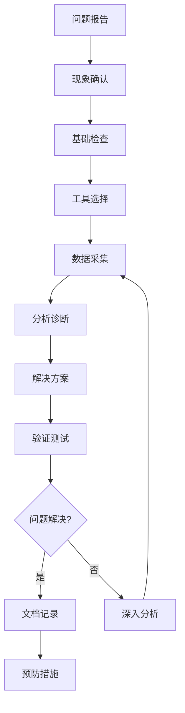

通过前5篇文章的学习，我们已经掌握了I2C从硬件基础到编程应用的完整知识体系。现在让我们进入实战调试阶段，学习如何诊断和解决I2C通信中的各种问题

就像医生需要听诊器、X光机等不同检查设备来诊断病情一样，开发工程师也需要专业的调试工具来分析和解决通信问题。有些问题可以**通过软件工具快速发现**，有些则需要**用硬件分析仪深入研究信号细节**。

本篇文章将介绍I2C开发中最实用的调试工具和测试方法，帮助你快速定位问题、分析原因、找到解决方案。

> [!tip]+ 学习路线指导 
> 本篇文章将从调试工具分类开始，先学习简单易用的软件工具（I2C-tools），再深入专业的硬件分析工具（逻辑分析仪），最后通过实际案例掌握系统化的问题诊断方法。建议边学边练，动手操作每一个工具。

## 1 调试工具概览

### 1.1 调试工具分类

想象一下汽车修理店的工具配置：有简单的万用表可以快速检查电路通断，也有专业的发动机分析仪可以深入诊断复杂问题。I2C调试工具也是这样，针对不同的问题需要使用不同层次的工具。

**I2C调试工具的分类和特点：**

| 工具类型       | 代表工具          | 主要功能             | 适用场景      | 学习难度 | 成本  |
| ---------- | ------------- | ---------------- | --------- | ---- | --- |
| **软件调试工具** | I2C-tools     | 设备扫描、寄存器读写、功能验证  | 快速验证、初步调试 | 简单   | 免费  |
| **逻辑分析仪**  | DSView、Saleae | 数字信号捕获、协议解码、时序分析 | 深度分析、复杂问题 | 中等   | 中等  |
| **示波器**    | 模拟示波器         | 模拟信号分析、信号完整性检查   | 电气特性分析    | 中等   | 较高  |
| **混合域示波器** | MSO系列         | 模拟+数字信号同步分析      | 综合信号分析    | 较难   | 高   |
| **专用分析仪**  | I2C总线分析仪      | 专业I2C协议分析        | 专业开发调试    | 较难   | 很高  |

**工具选择的实用指南：**

```txt
遇到I2C问题时的工具选择：
├── 设备无法识别？
│   └── 使用 i2cdetect 扫描总线 → 确认硬件连接
├── 通信功能异常？  
│   └── 使用 i2cget/i2cset 测试寄存器 → 验证通信路径
├── 数据传输错误？
│   └── 使用逻辑分析仪查看协议 → 分析传输细节
├── 通信偶发失败？
│   └── 使用触发采集捕获异常 → 定位异常时刻
├── 信号质量问题？
│   └── 使用示波器检查波形 → 分析电气特性
└── 系统级复杂问题？
    └── 结合多种工具综合分析 → 系统化诊断
```

换句话说，软件工具就像汽车的仪表盘，能快速告诉你系统的基本状态；硬件工具就像专业的检测设备，能深入分析具体的技术细节。我们的策略是先用简单工具快速筛查，再用专业工具深入分析。

### 1.2 示波器vs逻辑分析仪

在硬件调试工具中，示波器和逻辑分析仪经常被拿来比较。就像拍照片和拍X光片的区别一样，它们虽然都能"看"信号，但看到的内容和用途完全不同。

让我们通过实际的I2C信号来理解这两种工具的差异：


- 示波器采集的IIC信号，我们通过自己的观察得到这一段IIC包含的信息，主机向地址为0XA0 的设备写入0X0C
- 通过示波器我们可以观察到IIC信号真实的模样， 但是我们也可以体会到示波器在分析数字信号的过程中有很多不便之处

**示波器看I2C信号的特点：**
- **优势：**
	- **真实波形显示**：能看到信号的实际模拟特性，包括上升/下降时间、过冲、振铃等电气细节
	- **精确时间测量**：可以测量精确的时序参数，如建立时间、保持时间、传播延迟
	- **信号质量评估**：能发现信号完整性问题，如噪声、干扰、电平异常、阻抗不匹配
- **局限性：**
	- **通道数限制**：普通示波器只有2-4个通道，而复杂的I2C系统可能需要监控更多信号
	- **存储深度制约**：存储深度 = 采样率 × 显示时间，高采样率时无法长时间记录
	  
	- **协议解码缺失**：只能看到原始波形，需要人工分析协议内容，效率较低

**逻辑分析仪看I2C信号的特点：**


**优势：**
- **多通道支持**：通常提供16-32个通道，可以同时监控多个I2C总线或相关信号
- **深存储能力**：存储深度通常可达几GB，能够长时间记录数字通信过程
- **自动协议解码**：内置I2C、SPI、UART等协议解码器，自动识别和显示协议内容
- **智能触发**：支持复杂的协议触发条件，如特定地址、数据模式、错误条件等

**局限性：**
- **数字化采样**：只能看到高低电平状态，无法分析模拟信号特性
- **时序精度限制**：虽然采样率高，但对于极高频或亚纳秒级时序分析不如示波器精确
- **信号质量盲区**：无法检测信号质量问题，如噪声裕量、驱动能力等

**实际应用中的选择策略：**

```c
// 根据问题类型选择工具
if (需要分析信号电气特性) {
    使用示波器;
    // 检查上升时间、信号完整性、噪声等
} else if (需要分析协议内容和逻辑) {
    使用逻辑分析仪;
    // 解码协议、分析数据流、触发特定条件
} else if (需要综合分析) {
    同时使用两种工具;
    // 用示波器看信号质量，用逻辑分析仪看协议内容
}
```

简单来说，示波器就像高精度的显微镜，能看清信号的细微变化；逻辑分析仪就像智能的翻译器，能理解数字通信的具体内容。两者结合使用，能够从电气层面到协议层面全方位分析I2C通信问题。

> [!note]+ 工具互补性 
> 在实际项目中，示波器和逻辑分析仪往往是互补使用的。先用逻辑分析仪定位协议问题，再用示波器分析信号质量问题，这样能够更高效地解决复杂的I2C通信故障。

## 2 I2C-tools工具详解

现在让我们学习Linux系统中最实用的I2C调试工具集 - I2C-tools。就像程序员的瑞士军刀一样，I2C-tools提供了一套完整的命令行工具，让我们能够快速验证I2C设备的连接和功能

想象一下搭建一个工具箱：我们需要先准备工具，然后合理摆放，最后确保每个工具都能正常使用。I2C-tools的安装配置也是这样的过程

`I2C-tools`包含一套专门用于Linux应用层测试各种I2C功能的工具。它的主要功能包括：
- **总线探测工具**：扫描和识别I2C设备
- **SMBus访问工具**：读写SMBus兼容设备
- **EEPROM操作工具**：专门针对存储器的操作
- **Python模块**：为SMBus访问提供编程接口

只要你使用的Linux内核包含I2C设备驱动，就可以正常使用这个工具集。

### 2.1 工具安装配置

**源码获取方法**

I2C-tools是开源项目，提供两种获取方式：

**方法一：直接下载压缩包**
```bash
# 从内核官网下载最新版本
wget https://mirrors.edge.kernel.org/pub/software/utils/i2c-tools/i2c-tools-4.3.tar.gz
tar -xzf i2c-tools-4.3.tar.gz
cd i2c-tools-4.3
```

**方法二：使用Git克隆（推荐）**
```bash
# 克隆官方仓库
git clone git://git.kernel.org/pub/scm/utils/i2c-tools/i2c-tools.git
cd i2c-tools

# 查看可用版本
git tag

# 切换到稳定版本
git checkout v4.3
```

> [!tip]+ 版本选择建议 
> 推荐使用Git方式获取源码，这样可以方便地查看版本历史、跟踪bug修复，同时也是优秀开发者必备的技能。

**交叉编译配置**：进入源码目录，修改Makefile中的编译工具配置
```makefile
# 修改 Makefile 文件的第26-27行
26         CC  ?= aarch64-linux-gnu-gcc    # 设置交叉编译器
27         AR  ?= aarch64-linux-gnu-ar     # 设置归档工具
```

**编译选项**：根据目标系统的需求选择编译方式
```bash
# 编译静态链接版本（推荐，便于部署）
make USE_STATIC_LIB=1

# 或者编译动态链接版本
make
```


编译完成后，会在不同目录生成可执行文件和库文件：
- `tools/` 目录：包含5个核心工具程序
- `lib/` 目录：包含共享库文件

**目标系统部署**：将编译好的文件部署到目标开发板
```bash
# 1. 复制核心工具到系统目录
adb push tools/i2cdetect /usr/sbin/
adb push tools/i2cdump /usr/sbin/
adb push tools/i2cget /usr/sbin/
adb push tools/i2cset /usr/sbin/
adb push tools/i2ctransfer /usr/sbin/

# 2. 如果遇到只读文件系统错误，需要重新挂载
mount -o remount,rw /

# 3. 设置可执行权限
chmod 777 /usr/sbin/i2c*

# 4. 复制共享库（动态链接版本需要）
adb push lib/libi2c.so.0.1.1 /usr/lib/libi2c.so.0
```


**安装验证**：验证工具是否正确安装
```bash
# 检查工具是否可用
i2cdetect -V
i2cget --help

# 检查系统I2C总线
i2cdetect -l
```

换句话说，I2C-tools的安装就像搭建一个专业的检修工具台：准备合适的工具、放在正确的位置、确保随时可用。一旦安装完成，我们就拥有了一套完整的I2C调试工具箱。

### 2.2 i2cdetect详解

`i2cdetect`就像I2C世界的"探测雷达"，能够**扫描并发现I2C总线上的所有设备**。这通常是我们遇到I2C问题时使用的第一个工具。

**i2cdetect命令格式**：I2C设备查询和总线扫描工具，用于检测I2C总线上连接的设备
```bash
# 基本命令格式
i2cdetect [-y] [-a] [-q | -r] i2cbus [first last]
```

**主要参数说明：**

|参数|功能说明|使用建议|
|---|---|---|
|`-y`|取消交互模式，直接执行操作|脚本中必用，避免手动确认|
|`-a`|强制扫描非规则地址（0x00-0x02, 0x78-0x7F）|一般不推荐，可能干扰系统|
|`-q`|使用SMBus"快速写入"命令进行探测|兼容性最好，默认推荐|
|`-r`|使用SMBus"接收字节"命令进行探测|部分设备可能不响应|
|`-F`|显示适配器功能列表并退出|了解硬件能力时使用|
|`-V`|显示版本信息并退出|确认工具版本|
|`-l`|列出系统中所有I2C总线|确定总线编号的第一步|
|`i2cbus`|要扫描的I2C总线编号或名称|通过-l参数获取|
|`first last`|扫描的设备地址范围（可选）|缩小扫描范围，提高效率|

**第一步：查看系统I2C总线情况**
```bash
# 列出系统中所有可用的I2C总线
i2cdetect -l
```

- `i2c-0`、`i2c-1` 等：总线编号，这是我们在命令中使用的编号
- `i2c adapter` 后面的内容：适配器描述和驱动信息
- 每个总线对应一个I2C控制器或多路复用器通道

**第二步：扫描指定总线上的设备**
```bash
# 扫描I2C总线1上的所有设备
i2cdetect -r -y 1
```

- **数字（如50、68）**：在该地址检测到设备并收到ACK响应
- **"--"**：该地址被探测但没有设备响应（返回NACK）
- **"UU"**：该地址正被内核驱动占用，跳过探测以避免冲突

**第三步：查询I2C控制器功能**
```bash
# 查询I2C总线2的硬件功能
i2cdetect -F 2
```

- `I2C`：是否支持标准I2C协议
- `SMBus Quick`：是否支持SMBus快速命令
- `SMBus Send/Receive Byte`：是否支持字节级SMBus操作
- `SMBus Block Process Call`：是否支持块级SMBus操作

**高级扫描技巧：**
```bash
# 只扫描特定地址范围（提高效率）
i2cdetect -y 1 0x48 0x4F

# 强制扫描保留地址（谨慎使用）
i2cdetect -a -y 1

# 在脚本中使用，自动处理多个总线
for bus in $(i2cdetect -l | grep 'i2c-' | cut -d'-' -f2 | cut -d' ' -f1); do
    echo "Scanning bus $bus:"
    i2cdetect -y $bus
    echo ""
done
```

**故障诊断应用：**
```bash
# 快速检查硬件连接
if i2cdetect -y 1 | grep -q "68"; then
    echo "MPU6050 detected on address 0x68"
else
    echo "MPU6050 not found, check connections"
fi
```

> [!warning]+ 使用注意事项
> 
> 1. 扫描过程会向每个地址发送探测信号，某些敏感设备可能会因此改变状态
> 2. UU标记的地址被内核驱动占用，强制访问可能导致系统不稳定
> 3. 避免同时运行多个i2cdetect进程，可能造成总线冲突

换句话说，i2cdetect就像I2C总线的"电话簿查询"：它能告诉你总线上有哪些设备"住户"，它们的"门牌号"（地址）是什么，以及它们是否在"家"（响应探测）。这是所有I2C调试工作的起点。

### 2.3 i2cget详解

`i2cget`就像一个精密的"读卡器"，能够**从I2C设备的指定寄存器中读取数据**。这是验证设备通信和检查设备状态最常用的工具。

**i2cget命令格式**：从I2C设备读取数据的工具，支持多种读取模式
```bash
# 基本命令格式
i2cget [-f] [-y] [-a] i2cbus chip-address [data-address [mode]]
```

**参数详细说明：**

|参数|功能说明|使用场景|
|---|---|---|
|`-f`|强制访问设备，即使它已被内核驱动占用|调试被驱动控制的设备|
|`-y`|取消交互模式，直接执行操作|脚本自动化必需|
|`-a`|允许操作保留地址（0x00-0x02, 0x78-0x7F）|特殊设备调试|
|`i2cbus`|I2C总线编号，来自i2cdetect -l的结果|指定目标总线|
|`chip-address`|目标设备的I2C地址（7位地址）|设备硬件确定|
|`data-address`|要读取的寄存器地址（可选）|指定读取位置|
|`mode`|数据读取模式|控制读取方式|

**读取模式说明：**

|模式|全称|功能说明|适用设备|
|---|---|---|---|
|`b`|read byte data（默认）|读取指定寄存器的一个字节|大多数I2C设备|
|`w`|read word data|读取指定寄存器的一个字（16位）|支持字操作的设备|
|`c`|write byte/read byte|先写一个字节，再读一个字节|某些特殊协议设备|

**基本读取操作示例：**
```bash
# 从总线2上地址0x18的设备读取0x10寄存器的值
i2cget -y -f 2 0x18 0x10
```

- 输出结果：`0x80` 表示从寄存器0x10读取到的数据是0x80

**不同模式的读取示例：**
```bash
# 字节模式读取（默认模式）
i2cget -y 1 0x50 0x00 b
# 输出：0x12

# 字模式读取（16位数据）
i2cget -y 1 0x68 0x3B w
# 输出：0x1234（高字节在前）

# 连续字节模式（特殊协议）
i2cget -y 1 0x48 0x01 c
# 先向0x01写入数据，再读取响应
```

**实际应用案例：**

**案例1：读取MPU6050的设备ID**
```bash
# MPU6050的WHO_AM_I寄存器位于0x75
i2cget -y 1 0x68 0x75
# 期望输出：0x68（表示设备正常）
```

**案例2：检查RTC设备的时间寄存器**
```bash
# 读取DS1307 RTC的秒寄存器
i2cget -y 1 0x68 0x00
# 输出：0x45（表示45秒，BCD编码）
```

**案例3：验证EEPROM数据完整性**
```bash
# 读取24C02 EEPROM的第一个字节
i2cget -y 0 0x50 0x00
# 检查是否为预期的数据值
```

**批量读取脚本示例：**
```bash
#!/bin/bash
# 批量读取MPU6050的加速度计数据
BUS=1
ADDR=0x68

echo "Reading MPU6050 accelerometer data:"
echo -n "ACCEL_XOUT_H: 0x"
i2cget -y $BUS $ADDR 0x3B
echo -n "ACCEL_XOUT_L: 0x"
i2cget -y $BUS $ADDR 0x3C
echo -n "ACCEL_YOUT_H: 0x"
i2cget -y $BUS $ADDR 0x3D
echo -n "ACCEL_YOUT_L: 0x"
i2cget -y $BUS $ADDR 0x3E
```

**错误处理和诊断：**
```bash
# 检查读取是否成功
if result=$(i2cget -y 1 0x68 0x75 2>/dev/null); then
    echo "Device ID: $result"
    if [ "$result" = "0x68" ]; then
        echo "MPU6050 detected correctly"
    else
        echo "Unexpected device ID: $result"
    fi
else
    echo "Failed to read device ID - check connections"
fi
```

**常见错误及解决方法：**

|错误信息|可能原因|解决方法|
|---|---|---|
|`Error: Could not open file`|I2C总线不存在|检查总线编号，使用i2cdetect -l确认|
|`Error: Read failed`|设备无响应|检查设备地址和硬件连接|
|`Error: Device busy`|设备被占用|使用-f参数强制访问，或停止相关驱动|
|`Error: Permission denied`|权限不足|使用sudo运行，或检查设备节点权限|

> [!tip]+ 实用技巧
> 
> 1. 读取设备前，先用i2cdetect确认设备存在
> 2. 查阅设备数据手册，确认寄存器地址和数据格式
> 3. 对于多字节数据，注意字节序（大端/小端）
> 4. 某些寄存器读取后会自动清零，连续读取可能得到不同结果

换句话说，i2cget就像一个"智能温度计"：你告诉它要测量哪个部位（寄存器地址），它就会准确地告诉你那里的"温度"（数据值）。通过系统地读取不同寄存器，我们可以全面了解设备的状态和工作情况。

### 2.4 i2cdump详解

`i2cdump`就像I2C设备的"全身体检仪"，能够**一次性读取设备所有寄存器的值**，提供设备状态的全景视图。这对于了解设备整体状态、对比寄存器差异特别有用。

**i2cdump命令格式**：批量读取I2C设备寄存器内容的工具，提供设备状态全景
```bash
# 基本命令格式  
i2cdump [-f] [-r first-last] [-y] [-a] i2cbus address [mode [bank [bankreg]]]
```

**参数详细说明：**

|参数|功能说明|实际应用|
|---|---|---|
|`-f`|强制访问设备，即使被内核驱动占用|调试系统控制的设备|
|`-r first-last`|限制读取的寄存器范围|只关注特定寄存器区域|
|`-y`|取消交互确认，直接执行|脚本自动化必需|
|`-a`|允许操作保留地址|特殊设备调试|
|`i2cbus`|I2C总线编号|指定目标总线|
|`address`|设备I2C地址|目标设备标识|
|`mode`|读取模式|控制读取方式和数据格式|

**读取模式详解：**

|模式|说明|适用场景|数据显示|
|---|---|---|---|
|`b`|单字节读取（默认）|标准I2C设备|每个寄存器显示1字节|
|`w`|16位字读取|支持字操作的设备|每个寄存器显示2字节|
|`s`|SMBus模块|SMBus兼容设备|SMBus标准格式|
|`i`|I2C模块读取|纯I2C协议设备|I2C标准格式|
|`c`|连续字节读取|带地址自增的设备（如EEPROM）|连续地址空间|
|`W`|类似w，但只在偶数地址发起读命令|特殊的EEPROM设备|优化的字读取|

**基本使用示例：**
```bash
# 读取总线2上地址0x18设备的所有寄存器
i2cdump -f -y 2 0x18
```


**输出格式解析：**
```txt
     0  1  2  3  4  5  6  7  8  9  a  b  c  d  e  f    0123456789abcdef
00: 12 34 56 78 9a bc de f0 11 22 33 44 55 66 77 88    ?4Vx??..?"3DUfw?
10: aa bb cc dd ee ff 00 11 22 33 44 55 66 77 88 99    ??....."3DUfw??
...
```
- **左侧数字**：寄存器地址的高4位（行）
- **顶部数字**：寄存器地址的低4位（列）
- **中间数值**：各寄存器的十六进制值
- **右侧字符**：数据的ASCII表示（不可打印字符显示为?）

**限制读取范围：**

```bash
# 只读取0x10到0x1F范围的寄存器
i2cdump -f -y -r 0x10-0x1F 2 0x18

# 输出：
     0  1  2  3  4  5  6  7  8  9  a  b  c  d  e  f
10: aa bb cc dd ee ff 00 11 22 33 44 55 66 77 88 99
```

**不同模式的应用示例：**

**字节模式（适用于大多数设备）：**
```bash
# 读取MPU6050的所有寄存器（字节模式）
i2cdump -y 1 0x68 b
```

**字模式（适用于16位寄存器设备）：**
```bash
# 读取支持字操作的温度传感器
i2cdump -y 1 0x48 w
```

**连续模式（适用于EEPROM）：**
```bash
# 读取24C256 EEPROM的内容
i2cdump -y 0 0x50 c
```

**实际应用案例：**

**案例1：MPU6050寄存器状态检查**
```bash
#!/bin/bash
# 检查MPU6050的关键寄存器状态
echo "MPU6050 Register Dump:"
i2cdump -y 1 0x68 -r 0x6B-0x75

# 重点检查电源管理和设备ID寄存器
echo "Power Management 1 (0x6B): $(i2cget -y 1 0x68 0x6B)"
echo "Device ID (0x75): $(i2cget -y 1 0x68 0x75)"
```

**案例2：EEPROM内容验证**
```bash
# 验证EEPROM写入是否成功
echo "Before write:"
i2cdump -y 0 0x50 -r 0x00-0x0F

# 写入测试数据
i2cset -y 0 0x50 0x00 0xAA
i2cset -y 0 0x50 0x01 0xBB

echo "After write:"
i2cdump -y 0 0x50 -r 0x00-0x0F
```

**案例3：设备状态对比分析**
```bash
# 保存设备初始状态
i2cdump -y 1 0x68 > mpu6050_initial.txt

# 进行某些操作后，再次读取并对比
i2cdump -y 1 0x68 > mpu6050_after.txt
diff mpu6050_initial.txt mpu6050_after.txt
```

**数据分析技巧：**
```bash
# 过滤出非零寄存器
i2cdump -y 1 0x68 | grep -v "00 00 00 00 00 00 00 00"

# 查找特定数据模式
i2cdump -y 1 0x68 | grep "ff ff"

# 统计寄存器使用情况
i2cdump -y 1 0x68 | awk '{for(i=2;i<=17;i++) if($i!="00") count++} END {print "Non-zero registers:", count}'
```

**故障诊断应用：**
```bash
# 检查设备是否正常初始化
check_device_init() {
    local bus=$1
    local addr=$2
    
    echo "Checking device initialization..."
    
    # 读取所有寄存器
    dump_output=$(i2cdump -y $bus $addr 2>/dev/null)
    
    if [ $? -eq 0 ]; then
        # 检查是否全部为0xFF（未连接）或0x00（未初始化）
        if echo "$dump_output" | grep -q "ff ff ff ff ff ff ff ff"; then
            echo "Warning: Device may not be connected (all 0xFF)"
        elif echo "$dump_output" | grep -q "00 00 00 00 00 00 00 00"; then
            echo "Warning: Device may not be initialized (all 0x00)"
        else
            echo "Device appears to be properly initialized"
        fi
    else
        echo "Error: Cannot communicate with device"
    fi
}

# 使用示例
check_device_init 1 0x68
```

> [!warning]+ 使用注意事项
> 
> 1. 某些寄存器读取后会改变状态（如状态寄存器、FIFO等）
> 2. 频繁读取可能影响设备正常工作
> 3. 对于大容量EEPROM，完整dump可能需要较长时间
> 4. 部分只写寄存器可能返回不可预测的值

**输出重定向和后处理：**
```bash
# 保存dump结果到文件
i2cdump -y 1 0x68 > device_dump.txt

# 提取特定区域并转换格式
i2cdump -y 1 0x68 -r 0x3B-0x48 | \
awk '/^[0-9a-f]+:/{for(i=2;i<=9;i++) printf "0x%s ", $i; print ""}'
```

换句话说，i2cdump就像医院的"全身CT扫描"：**一次检查就能看到设备内部所有寄存器的状态**，帮助我们快速发现异常、对比变化、分析问题。通过系统地分析dump结果，我们可以深入理解设备的工作状态和行为模式。

### 2.5 i2cset详解

`i2cset`就像I2C设备的"遥控器"，能够**向设备的指定寄存器写入数据，控制设备的行为和配置**。这是测试设备功能、修改设备配置最重要的工具。

**i2cset命令格式**：向I2C设备写入数据的工具，支持多种写入模式和数据验证
```bash
# 基本命令格式
i2cset [-f] [-y] [-m mask] [-r] i2cbus chip-address data-address [value] ... [mode]
```

**参数详细说明：**

|参数|功能说明|使用场景|
|---|---|---|
|`-f`|强制访问设备，即使被内核驱动占用|调试系统控制的设备|
|`-y`|取消交互确认，直接执行|脚本自动化必需|
|`-m mask`|使用掩码进行部分位操作|只修改寄存器的特定位|
|`-r`|写入后立即读取验证|确认写入是否成功|
|`i2cbus`|I2C总线编号|指定目标总线|
|`chip-address`|设备I2C地址|目标设备标识|
|`data-address`|目标寄存器地址|指定写入位置|
|`value`|要写入的数据值|具体的配置数据|
|`mode`|写入模式|控制写入方式|

**写入模式详解：**

|模式|说明|数据长度|适用设备|
|---|---|---|---|
|`b`|字节模式（默认）|1字节|大多数I2C设备|
|`w`|字模式|2字节（16位）|支持字操作的设备|
|`s`|SMBus Block Write|可变长度|SMBus兼容设备|
|`i`|I2C Block Write|可变长度|纯I2C协议设备|

**基本写入操作示例：**
```bash
# 向总线2上地址0x18的设备的0x10寄存器写入0x55
i2cset -y 2 0x18 0x10 0x55

# 写入并验证（推荐方式）
i2cset -y -r 2 0x18 0x10 0x55
```

1. 使用i2cset写入数据
2. 使用i2cget读取验证
3. 确认写入成功

**不同模式的写入示例：**

**字节模式写入（最常用）：**
```bash
# 向MPU6050的电源管理寄存器写入0x00（唤醒设备）
i2cset -y 1 0x68 0x6B 0x00 b

# 设置采样率分频器
i2cset -y 1 0x68 0x19 0x07 b
```

**字模式写入（16位数据）：**
```bash
# 向温度传感器写入16位阈值（高字节在前）
i2cset -y 1 0x48 0x02 0x1A00 w
```

**块模式写入（多字节）：**
```bash
# 向EEPROM写入多个字节
i2cset -y 0 0x50 0x00 0x01 0x02 0x03 0x04 i
```

**掩码操作（部分位修改）：** 掩码操作允许我们只修改寄存器的特定位，而不影响其他位
```bash
# 只设置寄存器的第2位（bit 2 = 0x04），保持其他位不变
# 原理：(原值 & ~掩码) | (新值 & 掩码)
i2cset -y 1 0x68 0x1B 0x04 -m 0x04

# 清除第2位，保持其他位不变
i2cset -y 1 0x68 0x1B 0x00 -m 0x04

# 设置多个位（bit 1和bit 3）
i2cset -y 1 0x68 0x1B 0x0A -m 0x0A
```

**实际应用案例：**

**案例1：MPU6050初始化配置**
```bash
#!/bin/bash
# MPU6050完整初始化脚本
BUS=1
ADDR=0x68

echo "Initializing MPU6050..."

# 1. 复位设备
echo "Resetting device..."
i2cset -y $BUS $ADDR 0x6B 0x80
sleep 0.1

# 2. 唤醒设备（退出睡眠模式）
echo "Waking up device..."
i2cset -y -r $BUS $ADDR 0x6B 0x00

# 3. 设置采样率为125Hz（1000Hz / (7+1) = 125Hz）
echo "Setting sample rate..."
i2cset -y -r $BUS $ADDR 0x19 0x07

# 4. 配置低通滤波器
echo "Configuring low-pass filter..."
i2cset -y -r $BUS $ADDR 0x1A 0x06

# 5. 配置陀螺仪量程为±250°/s
echo "Setting gyroscope range..."
i2cset -y -r $BUS $ADDR 0x1B 0x00

# 6. 配置加速度计量程为±2g
echo "Setting accelerometer range..."
i2cset -y -r $BUS $ADDR 0x1C 0x00

echo "MPU6050 initialization complete!"

# 验证配置
echo "Verifying configuration:"
echo "Power Management 1: 0x$(i2cget -y $BUS $ADDR 0x6B)"
echo "Sample Rate Div: 0x$(i2cget -y $BUS $ADDR 0x19)"
echo "Config: 0x$(i2cget -y $BUS $ADDR 0x1A)"
```

**案例2：RTC时间设置**
```bash
#!/bin/bash
# 设置DS1307 RTC时间为 12:34:56
BUS=1
ADDR=0x68

# DS1307使用BCD格式存储时间
# 12时 = 0x12, 34分 = 0x34, 56秒 = 0x56

echo "Setting RTC time to 12:34:56..."
i2cset -y $BUS $ADDR 0x00 0x56  # 秒
i2cset -y $BUS $ADDR 0x01 0x34  # 分
i2cset -y $BUS $ADDR 0x02 0x12  # 时

# 验证设置
echo "Reading back time:"
echo "Hours: 0x$(i2cget -y $BUS $ADDR 0x02)"
echo "Minutes: 0x$(i2cget -y $BUS $ADDR 0x01)"
echo "Seconds: 0x$(i2cget -y $BUS $ADDR 0x00)"
```

**案例3：GPIO扩展器控制**
```bash
#!/bin/bash
# 控制PCF8574 GPIO扩展器
BUS=1
ADDR=0x20

# PCF8574的8个GPIO引脚状态（1=输入/高电平，0=输出/低电平）
# 设置GPIO状态：P7-P0 = 10101010
gpio_state=0xAA

echo "Setting GPIO state to 0x$gpio_state"
i2cset -y $BUS $ADDR $gpio_state

# 读取当前GPIO状态
current_state=$(i2cget -y $BUS $ADDR)
echo "Current GPIO state: $current_state"
```

**错误处理和验证：**
```bash
# 带完整错误处理的写入函数
i2c_write_verify() {
    local bus=$1
    local addr=$2
    local reg=$3
    local value=$4
    
    echo "Writing 0x$value to register 0x$reg..."
    
    # 执行写入
    if i2cset -y $bus $addr $reg $value 2>/dev/null; then
        # 读取验证
        read_value=$(i2cget -y $bus $addr $reg 2>/dev/null)
        
        if [ "$read_value" = "0x$value" ]; then
            echo "Write verified successfully"
            return 0
        else
            echo "Write verification failed: expected 0x$value, got $read_value"
            return 1
        fi
    else
        echo "Write operation failed"
        return 1
    fi
}

# 使用示例
i2c_write_verify 1 0x68 0x6B 0x00
```

**批量配置脚本：**
```bash
#!/bin/bash
# 批量配置多个寄存器
configure_device() {
    local bus=$1
    local addr=$2
    shift 2
    
    # 参数格式：reg1 val1 reg2 val2 ...
    while [ $# -ge 2 ]; do
        local reg=$1
        local val=$2
        shift 2
        
        echo "Setting register 0x$reg = 0x$val"
        if ! i2cset -y -r $bus $addr $reg $val; then
            echo "Failed to set register 0x$reg"
            return 1
        fi
    done
    
    echo "Device configuration complete"
}

# 使用示例：配置MPU6050
configure_device 1 0x68 \
    0x6B 0x00 \
    0x19 0x07 \
    0x1A 0x06 \
    0x1B 0x00 \
    0x1C 0x00
```

> [!warning]+ 写入安全注意事项
> 
> 1. 写入前仔细查阅设备数据手册，确认寄存器功能和取值范围
> 2. 某些寄存器写入后无法撤销，可能永久改变设备状态
> 3. 错误的配置可能导致设备无响应或损坏
> 4. 建议先在测试设备上验证，再应用到正式产品

> [!tip]+ 最佳实践建议
> 
> 1. 总是使用-r参数进行写入验证
> 2. 在脚本中添加充分的错误检查
> 3. 保存设备的原始配置，便于恢复
> 4. 对于复杂配置，分步骤进行并验证每一步

换句话说，i2cset就像设备的"调节旋钮"：通过精确地设置不同的寄存器值，我们可以控制设备的各种功能和行为。正确使用i2cset，就能让I2C设备按照我们的需要工作。

### 2.6 i2ctransfer详解

`i2ctransfer`是I2C-tools中最强大和灵活的工具，就像"**万能钥匙**"一样，能够**实现复杂的I2C传输操作**。它支持在一次传输中发送多个消息，完美支持现代I2C设备的复杂通信模式。

**i2ctransfer命令格式**：执行复合I2C传输的高级工具，支持一次传输中包含多个读写操作

```bash
# 基本命令格式
i2ctransfer [-f] [-y] [-v] [-a] i2cbus desc [data] [desc [data]]
```

**参数详细说明：**

|参数|功能说明|实际用途|
|---|---|---|
|`-f`|强制访问设备，即使被内核驱动占用|调试系统控制的设备|
|`-y`|取消交互模式，直接执行操作|脚本自动化必需|
|`-v`|启用详细输出，显示所有传输信息|调试复杂传输过程|
|`-a`|允许操作保留地址（0x00-0x02, 0x78-0x7F）|特殊设备调试|
|`i2cbus`|I2C总线编号|指定目标总线|
|`desc`|传输描述符，定义操作类型和参数|核心功能控制|
|`data`|要发送的数据（写操作时需要）|具体传输内容|

**传输描述符格式：**

传输描述符是i2ctransfer的核心，格式为：`[方向][长度]@[地址]`

|组件|说明|示例|
|---|---|---|
|`方向`|`w`=写操作，`r`=读操作|`w`, `r`|
|`长度`|传输的字节数|`1`, `4`, `16`|
|`@地址`|目标设备的I2C地址|`@0x68`, `@0x50`|

**基本操作示例：**

**简单写操作：**
```bash
# 向地址0x18的设备写入5个字节：0x10, 0x01, 0x02, 0x03, 0x04
i2ctransfer -f -y 2 w5@0x18 0x10 0x01 0x02 0x03 0x04
```


**简单读操作：**
```bash
# 从地址0x18的设备读取4个字节
i2ctransfer -f -y 2 r4@0x18
```

**复合传输（写后读）：**
```bash
# 先向0x18设备写入寄存器地址0x10，然后读取4个字节
i2ctransfer -f -y 2 w1@0x18 0x10 r4@0x18
```


**高级应用案例：**

**案例1：EEPROM随机读取**
```bash
#!/bin/bash
# 从24C256 EEPROM的指定地址读取数据
BUS=0
ADDR=0x50
READ_ADDR=0x0100  # 要读取的EEPROM地址（256）
READ_LEN=16       # 读取长度

echo "Reading $READ_LEN bytes from EEPROM address 0x$READ_ADDR"

# EEPROM需要先发送16位地址，然后读取数据
# 地址拆分：高字节和低字节
addr_h=$((READ_ADDR >> 8))
addr_l=$((READ_ADDR & 0xFF))

# 执行复合传输：写地址 + 读数据
result=$(i2ctransfer -y $BUS w2@$ADDR $addr_h $addr_l r$READ_LEN@$ADDR)

echo "Read data: $result"
```

**案例2：MPU6050连续数据读取**
```bash
#!/bin/bash
# 读取MPU6050的完整传感器数据（14字节）
BUS=1
ADDR=0x68
REG_START=0x3B  # ACCEL_XOUT_H寄存器

echo "Reading MPU6050 sensor data..."

# 一次性读取加速度、温度、陀螺仪数据
data=$(i2ctransfer -y $BUS w1@$ADDR $REG_START r14@$ADDR)

echo "Raw sensor data: $data"

# 解析数据（简化版）
read -a values <<< "$data"
accel_x=$((0x${values[0]} << 8 | 0x${values[1]}))
accel_y=$((0x${values[2]} << 8 | 0x${values[3]}))
accel_z=$((0x${values[4]} << 8 | 0x${values[5]}))

echo "Accelerometer: X=$accel_x, Y=$accel_y, Z=$accel_z"
```

**案例3：多设备批量操作**
```bash
#!/bin/bash
# 批量读取多个温度传感器的数据
BUS=1
SENSORS=(0x48 0x49 0x4A)  # 多个LM75温度传感器地址

echo "Reading temperature from multiple sensors..."

# 构造复合传输命令
cmd="i2ctransfer -y $BUS"

for addr in "${SENSORS[@]}"; do
    # 每个传感器：写寄存器地址0x00，然后读取2字节温度数据
    cmd="$cmd w1@$addr 0x00 r2@$addr"
done

# 执行批量传输
result=$(eval $cmd)
echo "Temperature data: $result"
```

**案例4：I2C设备配置和验证**
```bash
#!/bin/bash
# 配置设备并立即验证的一体化操作
BUS=1
ADDR=0x68

echo "Configuring and verifying MPU6050..."

# 一次传输中完成：配置电源管理 + 读取验证 + 配置采样率 + 读取验证
result=$(i2ctransfer -v -y $BUS \
    w2@$ADDR 0x6B 0x00 \
    w1@$ADDR 0x6B r1@$ADDR \
    w2@$ADDR 0x19 0x07 \
    w1@$ADDR 0x19 r1@$ADDR)

echo "Configuration result: $result"
```

**高级特性应用：**

**连续写入模式：**
```bash
# 向EEPROM连续写入一页数据（32字节）
page_data=(0x00 0x10)  # 起始地址：0x0010
for i in {0..31}; do
    page_data+=($((i + 0xA0)))  # 测试数据
done

i2ctransfer -y 0 w34@0x50 "${page_data[@]}"
```

**条件传输：**
```bash
# 读取设备ID，根据结果决定后续操作
device_id=$(i2ctransfer -y 1 w1@0x68 0x75 r1@0x68)

if [ "$device_id" = "0x68" ]; then
    echo "MPU6050 detected, configuring..."
    i2ctransfer -y 1 w2@0x68 0x6B 0x00  # 唤醒设备
else
    echo "Unexpected device ID: $device_id"
fi
```

**性能测试：**
```bash
#!/bin/bash
# 测试连续读取性能
BUS=1
ADDR=0x68
COUNT=1000

echo "Performance test: $COUNT consecutive reads"
start_time=$(date +%s.%N)

for ((i=1; i<=COUNT; i++)); do
    i2ctransfer -y $BUS w1@$ADDR 0x3B r6@$ADDR > /dev/null
done

end_time=$(date +%s.%N)
duration=$(echo "$end_time - $start_time" | bc)
rate=$(echo "scale=2; $COUNT / $duration" | bc)

echo "Duration: ${duration}s"
echo "Rate: ${rate} reads/second"
```

**错误处理和调试：**
```bash
# 带详细错误处理的传输函数
i2c_safe_transfer() {
    local bus=$1
    shift
    local desc="$*"
    
    echo "Executing: i2ctransfer -y $bus $desc"
    
    # 执行传输并捕获错误
    if result=$(i2ctransfer -y $bus $desc 2>&1); then
        echo "Success: $result"
        return 0
    else
        echo "Error: $result"
        
        # 分析常见错误
        case "$result" in
            *"No such device"*)
                echo "Device not found - check address and connections"
                ;;
            *"Resource busy"*)
                echo "Device busy - may be in use by kernel driver"
                ;;
            *"Remote I/O error"*)
                echo "Communication error - check signal integrity"
                ;;
            *)
                echo "Unknown error occurred"
                ;;
        esac
        return 1
    fi
}

# 使用示例
i2c_safe_transfer 1 w1@0x68 0x75 r1@0x68
```

**与其他工具的协作：**
```bash
# i2ctransfer与i2cdetect结合使用
scan_and_read() {
    local bus=$1
    
    # 先扫描设备
    echo "Scanning bus $bus..."
    devices=$(i2cdetect -y $bus | grep -o '[0-9a-f][0-9a-f]' | grep -v '^[0-9]$')
    
    # 对每个设备尝试读取设备ID
    for addr in $devices; do
        echo "Trying to read device ID from 0x$addr..."
        
        # 尝试常见的设备ID寄存器地址
        for reg in 0x00 0x0F 0x75 0xFF; do
            if result=$(i2ctransfer -y $bus w1@0x$addr $reg r1@0x$addr 2>/dev/null); then
                echo "  Register $reg: $result"
            fi
        done
    done
}

scan_and_read 1
```

> [!tip]+ i2ctransfer优势
> 
> 1. **原子性操作**：整个传输过程不会被其他I2C操作中断
> 2. **效率提升**：减少了多次系统调用的开销
> 3. **复杂协议支持**：完美支持需要RESTART信号的复杂设备
> 4. **灵活组合**：可以自由组合读写操作满足各种需求

> [!warning]+ 使用注意事项
> 
> 1. 传输描述符的语法必须严格正确
> 2. 复杂传输失败时难以定位具体哪一步出错
> 3. 某些老旧设备可能不支持复合传输
> 4. 传输长度受硬件和驱动限制

换句话说，i2ctransfer就像I2C通信的"编程语言"：它允许我们用简洁的描述符语法编写复杂的通信程序，实现其他工具难以完成的高级操作。掌握i2ctransfer，就掌握了I2C调试的最高技艺。

## 3 逻辑分析仪应用

软件工具虽然方便易用，但**只能告诉我们"发生了什么"，无法看到"是怎么发生的"**。就像医生除了问诊还需要用听诊器、X光等设备一样，深入的I2C分析需要专业的硬件工具。逻辑分析仪就是I2C调试的"显微镜"

逻辑分析仪使用详情可参考：[https://www.dreamsourcelab.com/doc/DSView_User_Guide.pdf](https://www.dreamsourcelab.com/doc/DSView_User_Guide.pdf)

### 3.1 设备连接准备

想象一下准备做一个精密实验：我们需要检查设备状态、连接测试导线、校准仪器参数。使用逻辑分析仪分析I2C信号也需要类似的准备过程。

**逻辑分析仪硬件检查**：首先确保逻辑分析仪与计算机正确连接：


**连接状态验证要点：**
1. **USB连接**：使用高质量的USB线缆，优先选择USB 3.0接口以获得最大带宽
2. **电源指示**：等待设备指示灯显示为绿色，表示设备已正常识别
3. **软件识别**：在DSView软件中确认显示正确的设备型号和序列号
4. **驱动状态**：确保设备驱动已正确安装，无黄色感叹号或错误提示

**测试导线连接方案**：逻辑分析仪通常提供多种连接选项，需要根据实际需求选择：


**连接配置说明：**

|导线类型|通道配置|适用场景|连接方式|
|---|---|---|---|
|**基础版导线**|4通道共享1根地线|低速I2C分析|通道0→SCL，通道1→SDA，GND→公共地|
|**增强版导线**|每通道独立地线|高速或多总线分析|每个信号都有独立地线参考|
|**专用夹具**|弹簧夹、针式探头|长时间监控|稳定连接，避免松动|

**I2C信号连接标准：**
```txt
推荐连接方式：
通道0 (CH0) → I2C SCL（时钟线）
通道1 (CH1) → I2C SDA（数据线）  
GND        → 被测系统地线（必须连接）

可选连接：
通道2 (CH2) → 复位信号或中断信号
通道3 (CH3) → 电源使能信号
...
```

**常见连接问题及解决方法：**

|问题现象|可能原因|解决方法|
|---|---|---|
|无法采集到信号|地线未连接|检查并连接地线|
|信号波形异常|电压阈值设置错误|调整阈值到适当电平|
|偶发性错误|连接不稳定|使用夹具或焊接连接|
|信号噪声严重|导线过长或环境干扰|缩短导线，改善环境|

> [!warning]+ 安全提醒
> 
> 1. 连接前确保被测系统已断电，避免短路损坏
> 2. 检查电压等级匹配，避免超出逻辑分析仪输入范围
> 3. 静电防护：操作前释放静电，避免损坏敏感器件
> 4. 不要在逻辑分析仪工作时插拔导线

换句话说，良好的硬件连接就像搭建稳固的实验平台：只有确保每个连接都牢固可靠，我们才能获得准确的测量数据，做出正确的分析判断。

### 3.2 采集参数设置

就像调节相机参数来拍摄不同场景一样，逻辑分析仪也需要根据I2C信号的特点来设置合适的采集参数。参数设置的好坏直接决定了分析结果的质量。

**采样率和采集时长的平衡**
- 逻辑分析仪的一个基本限制是：**存储深度 = 采样率 × 采集时长**


**采样率选择指南：**

|I2C速率|推荐采样率|理由|采集时长|
|---|---|---|---|
|100kHz（标准模式）|2MHz-4MHz|20-40倍过采样，确保时序精度|几秒到几分钟|
|400kHz（快速模式）|8MHz-16MHz|20-40倍过采样，捕获边沿细节|几十秒|
|1MHz（快速+模式）|20MHz-40MHz|20-40倍过采样，高精度分析|几秒到几十秒|
|3.4MHz（高速模式）|68MHz-100MHz|20-30倍过采样，专业分析|短时间采集|

**实际参数配置示例：**

```txt
典型I2C分析场景的参数设置：

场景1：MPU6050初始化分析（100kHz I2C）
├── 采样率：4MHz
├── 采集时长：10秒  
├── 存储需求：4M × 10 = 40M样本
└── 适用于：完整初始化过程分析

场景2：EEPROM数据传输分析（400kHz I2C）
├── 采样率：16MHz
├── 采集时长：2秒
├── 存储需求：16M × 2 = 32M样本  
└── 适用于：页写入操作分析

场景3：快速通信故障分析（1MHz I2C）
├── 采样率：40MHz
├── 采集时长：100ms
├── 存储需求：40M × 0.1 = 4M样本
└── 适用于：时序错误定位
```

**运行模式选择**：DSView提供两种主要的运行模式
**电压阈值配置**：电压阈值决定了逻辑分析仪如何判断数字信号的高低电平


**Stream模式 vs Buffer模式对比：**

|特性|Stream模式|Buffer模式|
|---|---|---|
|**存储深度**|基于PC内存，可达GB级|设备内存限制，通常几百MB|
|**采样率**|受通道数影响，动态调整|固定最大采样率|
|**触发功能**|仅支持简单触发|支持高级触发功能|
|**实时性**|实时显示，适合长时间监控|先采集后分析|
|**适用场景**|长时间数据记录、系统监控|精确触发、复杂协议分析|

> [!tip]+ 注意
> stream模式下DSView无法进行高级触发，只能进行一些简单触发，如果需要用逻辑分析仪抓取特定的数据的话需要将运行模式调整到buffer模式下
> 

**阈值设置标准：**

|系统电压|推荐阈值|噪声裕量|适用设备|
|---|---|---|---|
|5V CMOS|2.5V|±1V|传统5V系统|
|3.3V CMOS|1.65V|±0.8V|现代3.3V系统|
|2.5V CMOS|1.25V|±0.6V|低压系统|
|1.8V CMOS|0.9V|±0.4V|超低压系统|

> [!tip]+ 阈值设置技巧
> 
> - 对于3.3V I2C系统，建议设置阈值为1.0V-1.5V
> - 阈值过高可能错过低电平信号
> - 阈值过低可能受噪声干扰
> - 可以通过观察信号质量来微调阈值


### 3.3 触发条件配置

触发条件就像摄影中的"快门按钮"，决定了什么时候开始记录信号。设置合适的触发条件，能让我们精确捕获想要分析的I2C通信片段，避免在海量数据中盲目搜索。

**简单触发设置** 对于初步的I2C信号捕获，`简单的边沿触发`通常就足够了


**基本触发类型：**

|触发类型|符号|功能说明|I2C应用场景|
|---|---|---|---|
|**上升沿**|↗|信号从低到高跳变时触发|捕获SCL时钟上升沿|
|**下降沿**|↘|信号从高到低跳变时触发|捕获I2C START信号|
|**双边沿**|↗↘|任意电平跳变时触发|监控SDA数据变化|
|**高电平**|─|信号保持高电平时触发|总线空闲状态检测|
|**低电平**|__|信号保持低电平时触发|总线忙碌状态检测|

**实用触发配置示例：**

```txt
常用I2C触发配置：

1. 捕获任意I2C传输：
   - 通道1(SDA)：下降沿触发
   - 原理：SDA下降沿通常是START信号的开始

2. 监控总线活动：
   - 通道0(SCL)：双边沿触发  
   - 原理：SCL任何变化都表示总线有活动

3. 捕获特定设备通信：
   - 需要使用高级触发功能
   - 根据设备地址和数据内容进行触发
```

**采集控制设置**


**采集模式说明：**

|采集模式|功能特点|适用场景|操作方式|
|---|---|---|---|
|**立即采集**|无需等待触发，立即开始采集|连续监控、总线状态检查|点击"立即"按钮|
|**正常采集**|等待触发条件满足后开始采集|精确捕获特定事件|点击"开始"按钮|
|**单次采集**|采集一次后自动停止|分析单个传输过程|设置单次模式|
|**重复采集**|按设定间隔重复采集|间歇性故障捕获|设置重复间隔|

**重复采集配置：**


重复采集特别适合以下场景：
- **间歇性故障分析**：设置1-2秒间隔，连续监控偶发问题
- **定期状态检查**：设置较长间隔，监控系统长期运行状态
- **对比分析**：在不同条件下重复采集，对比波形差异

**触发位置优化**：触发位置决定了感兴趣的事件在采集窗口中的位置


**位置选择策略：**

```txt
触发位置选择指南：

前端触发（1%-10%）：
├── 优点：能看到触发后的完整过程
├── 缺点：看不到触发前的原因
└── 适用：分析事件的后续发展

中间触发（40%-60%）：
├── 优点：能看到事件的前因后果
├── 缺点：前后时间都有限
└── 适用：全面分析单个事件

后端触发（90%-99%）：
├── 优点：能看到导致事件的完整过程
├── 缺点：看不到事件的后续结果
└── 适用：分析事件的触发原因
```

**实际应用示例：**

```bash
# 根据分析目标选择触发位置
1. 分析I2C通信错误：
   - 位置：10%-20%（前端触发）
   - 目的：看到错误发生后的处理过程

2. 分析通信异常原因：
   - 位置：80%-90%（后端触发）
   - 目的：看到导致异常的完整过程

3. 分析完整传输过程：
   - 位置：50%（中间触发）
   - 目的：看到传输的开始和结束
```

换句话说，触发条件配置就像设置"自动拍照"的条件：告诉相机在什么情况下按快门，在什么位置开始录制，这样就能准确捕获到我们想要分析的"精彩瞬间"。

### 3.4 波形查看技巧

获得波形数据后，如何高效地查看和分析这些数据就成了关键。就像阅读一本书需要掌握速读、精读、标记等技巧一样，分析逻辑分析仪的波形也需要掌握一套实用的技巧。

**波形缩放和导航**

**基本缩放操作：**

|操作方式|功能效果|使用技巧|
|---|---|---|
|**鼠标滚轮**|以鼠标位置为中心缩放|快速调整显示精度|
|**左右方向键**|按固定比例缩放|键盘操作，精确控制|
|**右键框选**|放大选中区域|精确放大感兴趣区域|
|**鼠标拖拽**|左右移动波形|浏览长波形数据|


**实用缩放策略：**

```txt
波形分析的三层缩放法：

第一层：全局视图（显示完整采集）
├── 目的：了解整体通信模式
├── 操作：缩小到显示全部数据
└── 观察：通信频率、间隔、异常点

第二层：传输视图（显示单次I2C传输）
├── 目的：分析具体传输内容
├── 操作：放大到单个I2C事务
└── 观察：地址、数据、ACK/NACK

第三层：细节视图（显示信号边沿）
├── 目的：分析时序和信号质量
├── 操作：放大到看清边沿细节
└── 观察：建立时间、保持时间、噪声
```

**频率和时序测量**

逻辑分析仪提供了强大的测量功能，帮助我们精确分析I2C信号的时序特性：


**自动测量功能：**

|测量类型|显示信息|I2C应用|
|---|---|---|
|**频率**|信号的重复频率|SCL时钟频率测量|
|**周期**|单个周期的时间长度|时钟周期分析|
|**占空比**|高电平时间占比|SCL占空比检查|
|**脉宽**|脉冲的持续时间|START/STOP信号宽度|

**测量操作技巧：**

```bash
# 精确测量I2C时序参数
1. SCL频率测量：
   - 将鼠标置于SCL信号中央
   - 自动显示频率和周期信息
   - 验证是否符合设计要求

2. 建立时间测量：
   - 放大到边沿细节
   - 测量SDA变化到SCL上升沿的时间
   - 确保满足tSU,DAT规范

3. 保持时间测量：
   - 测量SCL下降沿到SDA变化的时间
   - 确保满足tHD,DAT规范
```

**光标和标记系统**

对于长波形数据，光标系统是快速导航和位置标记的利器：


**光标使用技巧：**

```txt
光标系统的三种用法：

1. 位置标记：
   - 在重要事件处双击添加光标
   - 用不同颜色区分不同类型事件
   - 例：红色标记错误，绿色标记正常

2. 快速导航：
   - 右击光标查看所有标记列表
   - 点击序号快速跳转到对应位置
   - 适用于长时间记录的快速浏览

3. 时间测量：
   - 使用两个光标测量时间间隔
   - 分析传输间隔、响应时间等
   - 验证时序是否符合规范
```

**实际应用案例：**

```bash
# 使用光标分析MPU6050初始化过程
1. 标记关键时刻：
   - 光标1：复位信号释放
   - 光标2：第一次寄存器写入
   - 光标3：设备响应确认
   - 光标4：初始化完成

2. 分析时间间隔：
   - 复位到首次访问的延时
   - 寄存器写入的间隔时间
   - 整个初始化过程的总时间

3. 异常定位：
   - 标记出现NACK的位置
   - 标记时序异常的位置
   - 便于后续详细分析
```

**波形显示优化**

**通道管理：**

```txt
有效的通道显示策略：

1. 信号分组：
   - I2C信号：SCL和SDA相邻显示
   - 控制信号：RESET、INT等分组
   - 辅助信号：电源、使能等分组

2. 高度调整：
   - 重要信号：增加显示高度
   - 辅助信号：减少显示高度
   - 节省屏幕空间，突出重点

3. 颜色配置：
   - SCL：蓝色（时钟特征明显）
   - SDA：红色（数据重要性高）
   - 控制信号：绿色或黄色
   - 便于快速识别和区分
```

**数据格式显示：**

|显示格式|适用场景|显示效果|
|---|---|---|
|**二进制**|位级分析|直观显示每一位状态|
|**十六进制**|数据分析|紧凑显示，便于计算|
|**十进制**|数值分析|直观理解数值大小|
|**ASCII**|文本数据|显示可读字符内容|

换句话说，波形查看技巧就像使用专业的放大镜：知道如何调节倍数、如何标记重点、如何快速定位，这样才能在复杂的波形"地图"中找到我们要寻找的"宝藏"。

## 4 协议分析方法

看到原始的波形只是第一步，真正的价值在于理解这些波形所代表的协议含义。就像看懂乐谱不仅要识别音符，还要理解节拍、调性和情感表达一样，I2C波形分析也需要从信号层面上升到协议层面。

### 4.1 协议解码设置

协议解码就像给波形配上"翻译器"，将复杂的高低电平变化转换为可读的协议信息。这大大提高了分析效率，让我们能够快速理解通信内容。

**解码功能激活**

在DSView中启用I2C协议解码需要按照以下步骤：


**第一步：访问解码功能**

- 点击菜单栏上的"解码"按钮
- 界面右侧会出现协议解码面板
- 显示可用的各种协议解码器

**第二步：选择I2C协议**


- 在协议列表中找到"I2C"选项
- 点击加号"+"添加I2C解码器
- 系统会在解码面板中添加一个I2C解码实例

**第三步：配置解码参数**


点击解码器旁边的设置按钮（齿轮图标）进入详细配置：

**关键配置参数：**

|参数类型|配置选项|功能说明|推荐设置|
|---|---|---|---|
|**显示内容**|Address/Data/Start/Stop/ACK|选择要显示的协议元素|全部选择，便于完整分析|
|**通道映射**|SCL/SDA通道分配|指定时钟和数据信号对应的通道|SCL→CH0, SDA→CH1|
|**地址格式**|7位/8位显示|设备地址的显示方式|7位（不含R/W位）|
|**解码区域**|全部/光标间|指定解码的时间范围|根据分析需要选择|

**第四步：通道映射配置**

正确的通道映射是解码成功的关键：

```txt
标准I2C通道映射：
├── SCL (Clock) → 通道0
├── SDA (Data)  → 通道1
└── 确保与实际连接一致
```

**解码区域设置**

解码区域决定了哪部分波形会被解码分析：


**区域选择策略：**

```txt
解码区域选择指南：

全部解码：
├── 适用：初步分析，了解整体通信模式
├── 优点：不遗漏任何信息
└── 缺点：处理时间长，信息量大

光标区间解码：
├── 适用：针对性分析特定传输
├── 优点：聚焦关键区域，提高效率
└── 缺点：需要预先定位感兴趣区域

实时解码：
├── 适用：Stream模式下的实时监控
├── 优点：即时反馈，便于调试
└── 缺点：性能要求高
```

**解码结果展示**

配置完成后，解码结果会以直观的方式显示在波形下方：


**解码信息解读：**

```txt
I2C解码结果包含的信息：

协议层信息：
├── START：传输开始标志
├── 地址：目标设备地址（如1010000）
├── R/W：读写方向位
├── ACK/NACK：应答状态
├── 数据：实际传输的数据内容
└── STOP：传输结束标志

时序信息：
├── 每个元素的时间位置
├── 传输持续时间
└── 元素间的时间间隔
```

**解码结果分析示例：**
1. **START信号**：传输开始
2. **设备地址**：1010000（0x50，EEPROM设备）
3. **写操作**：R/W位为0
4. **ACK确认**：设备响应正常
5. **寄存器地址**：0x15
6. **RESTART信号**：重新开始，切换为读操作
7. **读数据**：0x54
8. **NACK**：主设备结束读取
9. **STOP信号**：传输结束

也就是说，这个解码结果显示的是：从地址为0x50的EEPROM设备的0x15地址读取数据，读到的值是0x54。

**解码优化技巧**

```bash
# 提高解码准确性的技巧
1. 采样率优化：
   - 确保采样率≥I2C频率的20倍
   - 避免因采样率不足导致解码错误

2. 信号质量检查：
   - 确认SCL和SDA信号清晰
   - 检查是否有噪声干扰

3. 阈值调整：
   - 根据实际信号电平调整阈值
   - 确保高低电平判断准确

4. 时序验证：
   - 对比解码结果与预期
   - 验证地址、数据的正确性
```

换句话说，协议解码设置就像给复杂的"摩斯密码"配上"解码器"：只要设置正确，就能将看似杂乱的信号变成清晰易懂的通信内容，大大提高分析效率。

### 4.2 高级触发技术

简单的边沿触发虽然实用，但面对复杂的I2C通信场景时就显得力不从心了。高级触发技术就像给逻辑分析仪配上"智能大脑"，能够识别特定的协议模式，精确捕获我们需要的通信片段。

**高级触发功能激活**

要使用高级触发功能，首先需要切换到Buffer模式并启用高级触发：


**重要提示：**
- 高级触发只在Buffer模式下可用
- Stream模式只支持简单触发
- 需要权衡存储深度和触发功能的需求

**触发位置精确控制**


触发位置决定了感兴趣的事件在采集窗口中的相对位置：

**位置选择策略：**
- **前置触发（10%-30%）**：重点观察事件后的响应和处理
- **中置触发（40%-60%）**：平衡观察事件的前因后果
- **后置触发（70%-90%）**：重点观察导致事件的原因和过程

**串行触发配置**：由于I2C是串行通信协议，我们需要选择串行触发类型


**I2C串行触发的关键配置项：**

**1. 起始和停止条件设置**


```txt
I2C协议的起始和停止条件定义：

起始条件（START）：
├── SCL = 高电平
├── SDA = 下降沿
└── 触发配置：SCL高电平 & SDA下降沿

停止条件（STOP）：
├── SCL = 高电平  
├── SDA = 上升沿
└── 触发配置：SCL高电平 & SDA上升沿
```

**配置步骤：**

1. 将SCL对应通道（通道0）设置为高电平
2. 将SDA对应通道（通道1）设置为下降沿（START）或上升沿（STOP）
3. 确保通道分配与实际连接一致

**2. 时钟配置**

时钟配置定义了数据采样的时刻：

```txt
I2C时钟采样配置：
├── 时钟通道：SCL对应的通道
├── 采样边沿：上升沿（标准I2C协议）
├── 数据有效性：SCL高电平期间SDA保持稳定
└── 变化时机：SCL低电平期间SDA可以变化
```

**3. 数据触发条件**

这是高级触发最强大的功能，可以根据具体的数据内容进行触发：


**数据触发参数说明：**

|参数|功能说明|配置示例|
|---|---|---|
|**数据通道**|SDA信号对应的通道号|通道1（如果SDA连接到CH1）|
|**数据位宽**|触发数据的位数|9位（8位数据+1位ACK）|
|**数据值**|要匹配的具体数据模式|010101110（0x57 + ACK）|

**实际应用案例：**

**案例1：捕获特定设备地址的通信**
```txt
目标：捕获对MPU6050（地址0x68）的访问

配置：
├── 数据通道：1（SDA）
├── 数据位宽：8
├── 数据值：11010000（0x68左移1位，写操作）
└── 说明：I2C地址需要左移1位，加上R/W位
```

**案例2：捕获特定寄存器的写入操作**
```txt
目标：捕获向MPU6050的0x6B寄存器写入数据

配置方案1（设备地址触发）：
├── 数据位宽：8
├── 数据值：11010000（0x68写地址）
└── 适用：捕获任何对MPU6050的访问

配置方案2（寄存器地址触发）：
├── 数据位宽：8  
├── 数据值：01101011（0x6B寄存器地址）
└── 适用：捕获任何设备的0x6B寄存器访问
```

**案例3：捕获错误条件（NACK信号）**
```txt
目标：捕获通信中的NACK错误

配置：
├── 数据位宽：9
├── 数据值：xxxxxxxxx1（任意8位数据+NACK）
└── 说明：最后一位为1表示NACK，x表示任意值
```

**高级触发策略**

**1. 分层触发策略**
```txt
从宽到窄的触发策略：

第一层：协议层触发
├── 触发条件：任何I2C START信号
├── 目的：捕获所有I2C活动
└── 适用：初步分析和问题定位

第二层：设备层触发  
├── 触发条件：特定设备地址
├── 目的：聚焦特定设备的通信
└── 适用：设备级问题分析

第三层：数据层触发
├── 触发条件：特定数据模式
├── 目的：捕获特定的通信内容
└── 适用：精确问题定位
```

**2. 组合触发条件**
```bash
# 复杂触发条件的设计思路
1. 多条件AND逻辑：
   - START信号 AND 特定地址 AND 特定数据
   - 实现精确的事件捕获

2. 状态机触发：
   - 第一步：捕获设备地址
   - 第二步：等待特定寄存器地址
   - 第三步：捕获数据值

3. 异常条件触发：
   - 正常条件的反向逻辑
   - 捕获超时、NACK、协议错误等
```

**触发验证和调试**
```bash
# 触发配置验证清单
□ 通道分配正确（SCL、SDA对应关系）
□ 起始条件配置符合I2C协议
□ 时钟采样边沿设置正确
□ 数据位宽匹配实际需求
□ 数据值格式正确（包含ACK位）
□ 触发位置适合分析目标

# 触发测试方法
1. 使用已知的通信模式测试
2. 逐步从简单到复杂验证
3. 对比触发结果与预期
4. 调整参数直到满足需求
```

**触发结果分析**


成功的触发会在指定位置捕获到匹配的信号，可以通过以下方式验证：
1. **时间位置确认**：触发点是否在预期的时间位置
2. **协议内容验证**：解码结果是否包含期望的地址和数据
3. **完整性检查**：是否捕获到完整的传输过程

换句话说，高级触发技术就像给逻辑分析仪配上"智能雷达"：不仅能发现目标，还能识别目标的特征，确保我们捕获到的正是我们想要分析的那个"特定时刻"。

### 4.3 Stack协议解析

在实际的I2C应用中，很多设备并不是简单地使用基础I2C协议，而是**在I2C基础上构建了更高层的应用协议**。就像网络通信中的TCP/IP协议栈一样，I2C也有自己的"协议栈"。Stack协议解析功能能够同时解析多个协议层，提供更深入的分析视角。

**多层协议的概念**
想象一下寄送包裹的过程：包裹本身有内容物，外面有包装盒，盒子上有快递单，快递单上有地址标签。每一层都有自己的信息和作用。I2C通信也是如此：

```txt
I2C多层协议示例（EEPROM访问）：

第5层：应用层
├── 功能：读取/写入存储内容
└── 含义：用户数据的存储和访问

第4层：EEPROM协议层  
├── 功能：地址指定、页写入、保护等
└── 含义：存储器特定的操作规范

第3层：I2C应用层
├── 功能：寄存器地址、数据传输
└── 含义：具体的读写操作序列

第2层：I2C协议层
├── 功能：START、地址、ACK、STOP
└── 含义：基础的I2C通信规范

第1层：物理层
├── 功能：电气信号、时序
└── 含义：实际的高低电平变化
```

**Stack解析配置步骤**

**第一步：选择多层协议支持的I2C解码器**


重要注意事项：
- 必须选择"1：I2C"而不是"0：I2C"
- "0：I2C"是基础版本，不支持多层协议解析
- "1：I2C"是增强版本，支持协议栈功能

**第二步：启用多层协议功能**


点击"多层协议"选项，系统会显示支持的高层协议列表。

**第三步：添加对应的高层协议**


根据被分析的设备类型，选择相应的高层协议：

**常见的高层协议类型：**

|协议类型|适用设备|主要功能|分析内容|
|---|---|---|---|
|**EEPROM**|串行存储器|存储器访问协议|地址解析、数据访问模式|
|**RTC**|实时时钟|时间数据格式|时间寄存器、BCD编码|
|**温度传感器**|LM75等|温度数据格式|温度值、配置寄存器|
|**GPIO扩展器**|PCF8574等|I/O控制协议|引脚状态、方向控制|
|**ADC/DAC**|模数转换器|转换数据格式|通道选择、转换结果|

**EEPROM协议解析实例**

以24C256 EEPROM为例，看看多层协议解析的效果：


**5层解码结果分析：**

```txt
层次化解码信息说明：

第5层（应用语义层）：
├── 显示：EEPROM Read Operation
├── 含义：这是一个EEPROM读取操作
└── 价值：直观理解操作目的

第4层（EEPROM协议层）：
├── 显示：Address=0x0100, Data=0x54
├── 含义：从地址0x0100读取数据0x54
└── 价值：存储器级别的操作理解

第3层（I2C应用层）：
├── 显示：Register Write + Read Sequence
├── 含义：先写地址，再读数据的序列
└── 价值：I2C应用模式识别

第2层（I2C协议层）：
├── 显示：START-Address-ACK-Data-NACK-STOP
├── 含义：完整的I2C传输协议
└── 价值：协议正确性验证

第1层（信号层）：
├── 显示：原始的SCL/SDA波形
├── 含义：实际的电气信号变化
└── 价值：时序和信号质量分析
```

**多层解析的优势**

**1. 分层理解**

```txt
不同层次提供不同视角：

硬件工程师关注：
├── 信号层：时序是否正确
├── 协议层：通信是否成功
└── 电气特性：信号质量如何

软件工程师关注：
├── 应用层：功能是否实现
├── 数据层：内容是否正确  
└── 逻辑层：流程是否合理

系统工程师关注：
├── 整体性：各层配合是否协调
├── 效率性：通信是否高效
└── 可靠性：错误处理是否完善
```

**2. 问题定位精度**

```bash
# 分层问题定位策略
1. 应用层错误：
   - 现象：功能不正常，但通信成功
   - 定位：检查数据内容、时序、逻辑
   
2. 协议层错误：
   - 现象：NACK、时序错误、格式问题
   - 定位：检查I2C协议实现
   
3. 物理层错误：
   - 现象：信号质量差、电平异常
   - 定位：检查硬件连接、电气特性
```

**3. 开发效率提升**

```txt
多层解析提升效率的方式：

快速定位：
├── 直接看到高层含义
├── 避免手工解析协议
└── 减少分析时间

全面分析：
├── 同时看到所有层次信息
├── 理解问题的根本原因
└── 制定针对性解决方案

协作沟通：
├── 不同专业人员关注不同层次
├── 统一的分析结果便于沟通
└── 提高团队协作效率
```

**实际应用技巧**

```bash
# Stack协议解析的使用技巧
1. 协议选择：
   - 根据实际设备选择对应协议
   - 查阅设备手册确认协议类型
   - 可以同时添加多个协议层

2. 参数配置：
   - 设置正确的设备地址范围
   - 配置协议特定参数
   - 验证配置与实际设备匹配

3. 结果验证：
   - 对比解析结果与预期
   - 检查各层信息的一致性
   - 验证高层含义的正确性

4. 性能优化：
   - 只启用必要的协议层
   - 限制解析的时间范围
   - 平衡详细程度与性能
```

换句话说，Stack协议解析就像给I2C通信配上"多语言翻译器"：不仅能翻译基础的"I2C语言"，还能理解其中的"EEPROM方言"、"传感器俚语"等，让我们从多个角度全面理解通信的真正含义。

## 5 协议深度分析

掌握了基本的解码和触发技术后，我们需要进一步深入分析I2C协议的细节。就像医生不仅要知道病人的症状，还要了解病理机制一样，深度的协议分析能帮助我们理解通信的本质特征和潜在问题。

### 5.1 物理信号分析

虽然逻辑分析仪主要处理数字信号，但通过仔细观察波形特征，我们仍然可以获得很多物理层面的信息。这些信息对于诊断信号完整性问题、优化硬件设计非常有价值。

**I2C物理信号特征**


从逻辑分析仪捕获的I2C信号中，我们可以观察到以下物理特征：

**1. 开漏输出特性**
```txt
I2C开漏输出的特征分析：

高电平特征：
├── 电平值：由上拉电阻决定
├── 上升边沿：相对缓慢（RC时间常数）
├── 保持稳定：多设备共享时的线与特性
└── 噪声敏感：高阻态容易受干扰

低电平特征：
├── 电平值：接近0V（器件输出）
├── 下降边沿：相对快速（器件驱动）
├── 驱动能力：器件主动拉低
└── 抗噪声：低阻态抗干扰能力强
```

**2. 上拉电阻效应**


上拉电阻值直接影响信号的时序特性：

|上拉电阻值|上升时间|功耗|驱动能力|适用频率|
|---|---|---|---|---|
|**1kΩ**|快|高|强|高频（1MHz+）|
|**4.7kΩ**|中等|中等|中等|标准（100-400kHz）|
|**10kΩ**|慢|低|弱|低频（<100kHz）|

**信号质量评估方法**

**1. 边沿质量分析**

```bash
# 通过逻辑分析仪评估边沿质量
1. 上升时间测量：
   - 放大到最高分辨率观察边沿
   - 测量10%-90%的上升时间
   - 与I2C规范要求对比

2. 下降时间测量：
   - 测量90%-10%的下降时间
   - 通常比上升时间快

3. 边沿单调性：
   - 检查是否有振荡或台阶
   - 识别过冲和振铃现象
```

**2. 占空比分析**

```txt
SCL时钟占空比的意义：

标准占空比（50%）：
├── 特征：高低电平时间相等
├── 优点：时序对称，兼容性好
└── 适用：大多数标准应用

非对称占空比：
├── 特征：高低电平时间不等
├── 原因：上拉电阻、负载不匹配
├── 影响：可能影响时序裕量
└── 解决：调整上拉电阻或驱动能力
```

**3. 信号完整性检查**

```bash
# 信号完整性问题的识别
1. 电平异常：
   - 高电平不足：检查上拉电阻、供电
   - 低电平过高：检查器件驱动能力
   - 电平漂移：检查温度、电源稳定性

2. 时序异常：
   - 建立时间不足：数据变化太晚
   - 保持时间不足：数据变化太早
   - 时钟抖动：SCL边沿不稳定

3. 噪声干扰：
   - 毛刺：短时间的错误跳变
   - 串扰：相邻信号的耦合
   - 电源噪声：供电不稳定的影响
```

**实际测量案例**

```bash
# 使用逻辑分析仪进行物理层分析的步骤
1. 高分辨率采集：
   - 设置高采样率（≥100MHz）
   - 聚焦关键时序区域
   - 获得清晰的边沿细节

2. 时序参数测量：
   - 建立时间（tSU,DAT）：SDA变化到SCL上升沿
   - 保持时间（tHD,DAT）：SCL下降沿到SDA变化
   - 时钟周期（tCLK）：SCL完整周期时间

3. 规范符合性检查：
   - 对比测量值与I2C规范
   - 识别时序裕量
   - 评估系统可靠性
```

**常见问题诊断**

|现象|可能原因|诊断方法|解决方案|
|---|---|---|---|
|**通信不稳定**|上拉电阻不当|测量上升时间|调整上拉电阻值|
|**偶发错误**|噪声干扰|观察信号纯净度|改善PCB布线、滤波|
|**速度受限**|负载过重|测量边沿质量|减少负载、提高驱动|
|**功耗过高**|上拉电阻过小|计算静态电流|增大上拉电阻|

换句话说，物理信号分析就像给I2C通信做"体检"：通过观察信号的"体征"（边沿、时序、电平），我们能够判断系统的"健康状况"，及早发现和预防潜在问题。

### 5.2 编码规则验证

I2C协议定义了严格的编码规则，这些规则确保了通信的可靠性和互操作性。通过逻辑分析仪验证这些规则的执行情况，能够帮助我们发现协议实现中的细微错误。

**START和STOP信号验证**：START和STOP信号是I2C通信的边界标志，必须严格遵循协议规范


**START信号验证要点：**
```txt
START信号的规范要求：

时序要求：
├── 前置条件：总线空闲（SCL=1, SDA=1）
├── 触发条件：SCL保持高电平期间，SDA下降沿
├── 后续状态：进入数据传输状态
└── 时间参数：tHD,STA（保持时间）≥ 4.0μs（标准模式）

验证方法：
├── 检查SCL状态：START时SCL必须为高
├── 检查SDA变化：必须是下降沿
├── 测量保持时间：SDA下降沿到SCL下降沿的时间
└── 验证序列完整性：START后必须跟地址字节
```

**STOP信号验证要点：**
```txt
STOP信号的规范要求：

时序要求：
├── 前置条件：SCL为低电平
├── 触发条件：SCL保持高电平期间，SDA上升沿
├── 后续状态：总线返回空闲状态
└── 时间参数：tSU,STO（建立时间）≥ 4.0μs（标准模式）

验证方法：
├── 检查SCL状态：STOP时SCL必须为高
├── 检查SDA变化：必须是上升沿
├── 测量建立时间：SCL上升沿到SDA上升沿的时间
└── 验证后续状态：STOP后总线必须空闲
```

**数据有效性规则验证**：I2C协议要求数据在时钟高电平期间保持稳定：


**数据有效性验证清单：**
```bash
# 数据有效性验证要点
1. 建立时间验证：
   - 测量：SDA变化到SCL上升沿的时间
   - 要求：tSU,DAT ≥ 250ns（标准模式）
   - 检查：所有数据位都满足要求

2. 保持时间验证：
   - 测量：SCL下降沿到SDA变化的时间
   - 要求：tHD,DAT ≥ 0ns（标准模式）
   - 检查：数据在SCL高电平期间稳定

3. 稳定性验证：
   - 检查：SCL高电平期间SDA无变化
   - 例外：START和STOP信号除外
   - 识别：协议违规和噪声干扰
```

**字节组织验证**：I2C数据以8位字节为单位传输，每个字节后跟一个应答位


**字节传输验证要点：**
```txt
字节传输的规范要求：

数据格式：
├── 位序：MSB优先（最高位先传）
├── 长度：每个字节恰好8位
├── 应答：每8位数据后有1位ACK/NACK
└── 序列：地址字节 → 数据字节（可选多个）

验证方法
├── 计数验证：确认每个字节恰好8个时钟
├── 顺序验证：确认MSB先传输
├── 应答验证：第9个时钟期间检查ACK/NACK
└── 完整性验证：检查字节边界的正确性
```

**ACK/NACK信号验证**：应答信号是I2C通信可靠性的重要保证


**应答信号验证规则：**
```txt
ACK/NACK验证要点：

ACK信号（应答）：
├── 时机：第9个SCL时钟周期
├── 条件：接收器成功接收数据
├── 电平：SDA = 0（低电平）
└── 控制：由接收方控制SDA

NACK信号（非应答）：
├── 时机：第9个SCL时钟周期
├── 条件：接收失败或传输结束
├── 电平：SDA = 1（高电平）
└── 控制：接收方不拉低SDA

验证方法：
├── 时机检查：确认在第9个时钟周期
├── 电平检查：确认ACK为低，NACK为高
├── 控制权检查：确认由正确的设备控制
└── 逻辑检查：验证ACK/NACK的合理性
```

**协议违规检测**：通过系统性的规则验证，我们可以检测各种协议违规
```bash
# 常见协议违规类型及检测方法
1. 时序违规：
   - 建立时间不足
   - 保持时间不足
   - 时钟频率超规范

2. 信号违规：
   - SCL高电平期间SDA变化（非START/STOP）
   - 不正确的START/STOP信号
   - 缺失的应答信号

3. 格式违规：
   - 字节长度错误（不是8位）
   - 应答位缺失
   - 地址格式错误

4. 逻辑违规：
   - 错误的设备地址
   - 不合理的数据序列
   - 传输方向错误
```

**验证自动化**
```bash
# 使用逻辑分析仪进行自动化验证
1. 协议解码器验证：
   - 启用I2C协议解码
   - 观察解码错误提示
   - 分析错误的具体位置

2. 测量功能验证：
   - 使用自动测量功能
   - 批量检查时序参数
   - 生成合规性报告

3. 触发条件验证：
   - 设置协议违规触发
   - 自动捕获异常事件
   - 分析异常发生的条件
```

换句话说，编码规则验证就像给I2C通信做"语法检查"：确保每个"句子"（传输）都符合"语法规则"（协议规范），这样才能保证"对话"（通信）的准确无误。

### 5.3 时序参数测量

时序参数是I2C协议的重要技术指标，直接影响通信的可靠性和速度。通过精确测量这些参数，我们可以验证系统设计的正确性，优化性能，并确保与其他设备的兼容性。

**I2C关键时序参数**


**主要时序参数分类：**

|参数类型|参数名称|符号|标准模式|快速模式|测量意义|
|---|---|---|---|---|---|
|**时钟相关**|时钟频率|fSCL|≤100kHz|≤400kHz|传输速度|
||时钟低电平时间|tLOW|≥4.7μs|≥1.3μs|数据建立窗口|
||时钟高电平时间|tHIGH|≥4.0μs|≥0.6μs|数据保持窗口|
|**数据相关**|数据建立时间|tSU,DAT|≥250ns|≥100ns|数据稳定性|
||数据保持时间|tHD,DAT|≥0ns|≥0ns|数据可靠性|
|**START/STOP**|START建立时间|tSU,STA|≥4.7μs|≥0.6μs|信号识别|
||START保持时间|tHD,STA|≥4.0μs|≥0.6μs|状态转换|
||STOP建立时间|tSU,STO|≥4.0μs|≥0.6μs|传输结束|

**时钟参数测量**

**1. 时钟频率和周期测量**
```bash
# 时钟频率测量方法
1. 自动测量：
   - 将鼠标放置在SCL信号上
   - 系统自动显示频率和周期
   - 适用于稳定的时钟信号

2. 手动测量：
   - 使用光标测量多个周期
   - 计算平均值提高精度
   - 适用于时钟抖动分析

3. 统计分析：
   - 测量长时间的频率变化
   - 分析频率稳定性
   - 检测时钟源问题
```

**2. 占空比测量**
```txt
SCL占空比分析：

理想占空比（50%）：
├── 优点：时序对称，兼容性好
├── 适用：大多数标准应用
└── 测量：tHIGH / (tHIGH + tLOW)

非理想占空比：
├── 原因：上拉电阻、负载不对称
├── 影响：时序裕量不均匀
├── 评估：是否影响时序要求
└── 优化：调整硬件参数
```

**数据时序测量**

**1. 建立和保持时间测量**


```bash
# 精确测量数据时序的方法
1. 建立时间（tSU,DAT）测量：
   - 定位：SDA数据变化点
   - 测量：到下一个SCL上升沿的时间
   - 要求：≥250ns（标准模式）
   - 技巧：放大波形提高测量精度

2. 保持时间（tHD,DAT）测量：
   - 定位：SCL下降沿
   - 测量：到SDA数据变化的时间
   - 要求：≥0ns（标准模式）
   - 注意：负值表示时序违规

3. 批量测量：
   - 选择多个数据位进行测量
   - 统计最小值、最大值、平均值
   - 识别时序裕量的分布情况
```

**2. START/STOP时序测量**
```txt
START/STOP信号时序分析：

START信号时序：
├── tSU,STA：SDA下降沿前SCL高电平时间
├── tHD,STA：SDA下降沿后到SCL下降沿时间
├── 验证：确保信号被正确识别
└── 优化：满足最严格的时序要求

STOP信号时序：
├── tSU,STO：SCL上升沿到SDA上升沿时间
├── 总线空闲：STOP后的静默时间
├── 验证：确保总线正确释放
└── 兼容：考虑下一次传输的启动时间
```

**时序裕量分析**

**1. 裕量计算方法**
```bash
# 时序裕量计算公式
1. 建立时间裕量：
   裕量 = 实际建立时间 - 最小要求建立时间
   
2. 保持时间裕量：
   裕量 = 实际保持时间 - 最小要求保持时间
   
3. 频率裕量：
   裕量 = 最大允许频率 - 实际工作频率

# 裕量评估标准
- 充足：裕量 > 50% × 要求值
- 适中：裕量 = 20%-50% × 要求值  
- 紧张：裕量 = 0%-20% × 要求值
- 不足：裕量 < 0（违规）
```

**2. 裕量优化策略**
```txt
时序裕量优化方法：

硬件优化：
├── 调整上拉电阻值
├── 优化PCB布线长度
├── 减少负载电容
└── 提高驱动器性能

软件优化：
├── 降低时钟频率
├── 增加软件延时
├── 优化时序控制
└── 调整驱动程序参数

系统优化：
├── 温度补偿设计
├── 电源纹波控制
├── EMI抑制措施
└── 多设备时序协调
```

**测量准确性保证**
```bash
# 提高测量精度的技巧
1. 采样率选择：
   - 推荐：≥20倍被测信号频率
   - 时序测量：≥100倍被测信号频率
   - 边沿分析：最高采样率

2. 触发设置：
   - 使用稳定的触发条件
   - 避免噪声触发
   - 重复测量提高可信度

3. 环境控制：
   - 稳定的温度条件
   - 干净的电源供应
   - 最小化电磁干扰

4. 校准验证：
   - 使用已知标准信号校准
   - 定期验证测量系统精度
   - 对比不同测量方法的结果
```

**常见测量问题及解决**

|问题现象|可能原因|解决方法|
|---|---|---|
|**测量值不稳定**|采样率不足、噪声干扰|提高采样率、改善信号质量|
|**边沿检测错误**|阈值设置不当|调整电压阈值到合适值|
|**时序违规**|硬件设计问题|优化电路设计、调整参数|
|**测量偏差大**|探头负载、连接问题|使用高阻探头、改善连接|

换句话说，时序参数测量就像给I2C通信做"精密体检"：通过测量各种"生理指标"（时序参数），我们能够准确评估系统的"健康状况"，及时发现"亚健康"状态，并采取相应的"保健措施"。

## 6 问题诊断方法

通过前面的学习，我们已经掌握了各种I2C调试工具和分析技术。现在让我们将这些技能整合起来，形成系统化的问题诊断方法。就像医生根据症状、检查结果进行综合诊断一样，I2C问题的解决也需要科学的诊断流程。

### 6.1 常见问题分类

在实际的I2C系统开发中，问题虽然千变万化，但通常可以归纳为几个主要类别。理解这些问题的特征和成因，有助于我们快速定位问题所在。

**按问题层次分类**

|问题层次|典型症状|主要原因|诊断工具|解决难度|
|---|---|---|---|---|
|**物理层问题**|无信号、信号异常|硬件连接、电气特性|万用表、示波器|中等|
|**协议层问题**|通信失败、时序错误|协议实现、时序违规|逻辑分析仪|较难|
|**应用层问题**|功能异常、数据错误|软件逻辑、配置错误|I2C-tools、调试器|较易|
|**系统级问题**|间歇故障、性能问题|多因素交互、环境影响|综合分析|困难|

**按故障现象分类**

**1. 完全无法通信**
```txt
症状特征：
├── i2cdetect扫描不到设备
├── 所有I2C操作都失败
├── 总线始终处于某种固定状态
└── 设备完全无响应

常见原因：
├── 硬件连接错误（开路、短路）
├── 电源问题（未上电、电压异常）
├── I2C总线被拉死（设备故障）
└── 时钟或复位信号异常
```

**2. 间歇性通信故障**
```txt
症状特征：
├── 有时能通信，有时失败
├── 特定条件下出现问题
├── 错误率随环境变化
└── 长时间运行后出现问题

常见原因：
├── 信号完整性问题（串扰、反射）
├── 温度相关问题（时序漂移）
├── 电源噪声干扰
├── 软件竞争条件
└── 多主机冲突
```

**3. 数据传输错误**
```txt
症状特征：
├── 能够通信但数据错误
├── 特定数据模式出错
├── 读写不一致
└── 校验和错误

常见原因：
├── 时序参数不匹配
├── 字节序理解错误
├── 寄存器地址错误
├── 数据格式理解错误
└── 缓存一致性问题
```

**4. 性能问题**
```txt
症状特征：
├── 通信速度慢于预期
├── 系统响应延迟
├── CPU占用率高
└── 功耗异常

常见原因：
├── 时钟频率设置不当
├── 软件实现效率低
├── 中断处理延迟
├── 总线利用率低
└── 功耗管理问题
```

**按影响范围分类**

|影响范围|问题特征|典型例子|分析重点|
|---|---|---|---|
|**单设备问题**|只影响特定设备|某个传感器不工作|设备配置、连接|
|**总线级问题**|影响整条I2C总线|所有设备都无法通信|总线状态、主控器|
|**系统级问题**|影响整个系统功能|系统启动失败|初始化序列、依赖关系|
|**间歇性问题**|偶发性影响|随机通信失败|环境因素、时序竞争|

**按时间特征分类**
```txt
故障时间模式分析：

启动时故障：
├── 特征：系统启动时就出现问题
├── 原因：初始化顺序、上电时序
├── 分析：检查启动日志、时序图
└── 解决：优化初始化流程

运行时故障：
├── 特征：运行一段时间后出现
├── 原因：温度漂移、器件老化
├── 分析：长时间监控、温度测试
└── 解决：参数调整、器件更换

负载相关故障：
├── 特征：高负载时出现问题
├── 原因：时序裕量不足、干扰
├── 分析：压力测试、信号分析
└── 解决：优化设计、降低负载

环境相关故障：
├── 特征：特定环境条件下出现
├── 原因：温度、湿度、EMI影响
├── 分析：环境测试、屏蔽实验
└── 解决：环境控制、加固设计
```

### 6.2 诊断流程

面对I2C问题，采用系统化的诊断流程比随机尝试更有效。这就像医生看病要遵循"问诊-体检-化验-诊断-治疗"的流程一样。

**标准诊断流程**



**第一阶段：问题确认和现象收集**

```bash
# 问题确认清单
□ 问题的具体表现是什么？
□ 问题什么时候开始出现？
□ 问题是否可重现？
□ 影响范围有多大？
□ 是否有环境或操作上的改变？
□ 错误信息和日志内容？
□ 系统配置和版本信息？

# 现象收集方法
1. 错误日志收集：
   - 系统日志：dmesg, syslog
   - 应用日志：程序输出、调试信息
   - 内核日志：I2C子系统相关信息

2. 环境信息收集：
   - 硬件版本：开发板、设备型号
   - 软件版本：内核版本、驱动版本
   - 配置信息：设备树、内核配置

3. 重现条件确认：
   - 必要条件：什么情况下一定出现
   - 充分条件：什么情况下可能出现
   - 时间模式：偶发、定时、持续
```

**第二阶段：基础检查和快速诊断**

```bash
# 基础检查步骤（按重要性排序）
1. 硬件连接检查：
   ✓ 电源是否正常（万用表测量）
   ✓ I2C引脚连接是否正确（SDA、SCL、GND）
   ✓ 上拉电阻是否存在（万用表测电阻）
   ✓ 设备地址配置是否正确（跳线、焊盘）

2. 软件基础检查：
   ✓ I2C总线是否启用（设备树配置）
   ✓ 内核驱动是否加载（lsmod检查）
   ✓ 设备节点是否存在（ls /dev/i2c-*）
   ✓ 权限是否正确（chmod, chown）

3. 快速功能验证：
   ✓ i2cdetect扫描设备（i2cdetect -y 1）
   ✓ 简单读写测试（i2cget, i2cset）
   ✓ 其他设备是否正常（排除系统性问题）
   ✓ 重启后是否恢复（排除状态问题）
```

**第三阶段：工具选择和数据采集**
```bash
# 根据问题类型选择合适的工具
1. 软件层面问题：
   - 主要工具：I2C-tools
   - 辅助工具：strace, debugfs
   - 采集内容：命令输出、系统调用轨迹

2. 协议层面问题：
   - 主要工具：逻辑分析仪
   - 配置参数：高采样率、协议解码
   - 采集内容：完整的通信时序

3. 硬件层面问题：
   - 主要工具：万用表、示波器
   - 测量项目：电压、波形、时序
   - 采集内容：模拟信号特征

4. 系统级问题：
   - 综合工具：多种工具结合
   - 长期监控：自动化测试脚本
   - 采集内容：统计数据、趋势分析
```

**第四阶段：分析诊断和根因定位**
```bash
# 分析方法和技巧
1. 分层分析法：
   - 从底层到高层逐层排查
   - 确认每一层的功能正常性
   - 定位问题所在的具体层次

2. 对比分析法：
   - 正常vs异常条件对比
   - 不同环境条件对比
   - 不同时间点状态对比

3. 排除分析法：
   - 逐个排除可能的原因
   - 用替换法验证假设
   - 缩小问题范围

4. 时序分析法：
   - 分析问题发生的时间模式
   - 寻找触发条件和环境因素
   - 建立因果关系模型
```

**第五阶段：解决方案实施和验证**
```bash
# 解决方案分类和实施
1. 硬件解决方案：
   - 连接修复：重新连接、焊接
   - 参数调整：上拉电阻、时钟频率
   - 器件更换：故障芯片、版本升级

2. 软件解决方案：
   - 配置修正：设备树、内核参数
   - 代码修复：驱动bug、时序调整
   - 逻辑优化：初始化顺序、错误处理

3. 系统解决方案：
   - 架构调整：总线分配、负载分配
   - 流程优化：启动顺序、通信协议
   - 冗余设计：备份方案、容错机制

# 验证测试方法
1. 功能验证：
   - 基本功能测试
   - 边界条件测试
   - 异常情况测试

2. 可靠性验证：
   - 长时间运行测试
   - 环境应力测试
   - 老化测试

3. 性能验证：
   - 响应时间测试
   - 吞吐量测试
   - 资源占用测试
```

### 6.3 解决方案库

基于实际项目经验，我们可以建立一个常见问题的解决方案库。这就像医生的"处方集"，遇到类似症状时可以快速找到对应的解决方案。

**硬件相关问题解决方案**

|问题现象|可能原因|解决方案|验证方法|
|---|---|---|---|
|**扫描不到设备**|连接开路|检查并重新连接SDA、SCL、GND|万用表测通断|
||电源未加|检查设备供电，确认电压正确|万用表测电压|
||地址错误|检查设备地址配置（跳线、焊盘）|查阅设备手册|
|**通信不稳定**|上拉电阻缺失|添加4.7kΩ上拉电阻到VDD|i2cdetect稳定性测试|
||电阻值不当|调整上拉电阻值（1k-10k范围）|示波器观察波形|
||线路过长|缩短连接线，<30cm|信号完整性测试|
|**速度受限**|上拉电阻过大|减小上拉电阻值到2.2kΩ|频率测量|
||负载过重|减少总线设备数量或增加驱动能力|负载分析|

**软件相关问题解决方案**

|问题现象|可能原因|解决方案|验证方法|
|---|---|---|---|
|**设备节点不存在**|I2C控制器未启用|设备树中启用I2C控制器|ls /dev/i2c-*|
||内核配置缺失|启用I2C核心和驱动支持|重新编译内核|
|**权限不足**|设备节点权限错误|chmod 666 /dev/i2c-*|用户态测试|
||用户组权限|将用户加入i2c组|groups命令检查|
|**驱动冲突**|多个驱动争抢设备|卸载冲突驱动或修改地址|lsmod, rmmod|
|**时序参数错误**|频率设置过高|降低I2C时钟频率|设备树修改|
||时序裕量不足|调整建立/保持时间参数|逻辑分析仪验证|

**协议相关问题解决方案**

|问题现象|可能原因|解决方案|验证方法|
|---|---|---|---|
|**收到NACK**|设备地址错误|确认并修正设备地址|i2cdetect扫描|
||设备忙碌|添加延时或检查设备状态|状态寄存器查询|
||寄存器地址无效|查阅手册确认寄存器映射|手册对照|
|**数据错误**|字节序不匹配|调整大小端字节序|数据对比验证|
||数据格式错误|确认数据编码格式（BCD等）|格式转换测试|
|**超时错误**|响应时间过长|增加超时时间参数|时间测量|
||时钟拉伸|支持时钟拉伸功能|协议分析|

**系统级问题解决方案**

|问题现象|可能原因|解决方案|验证方法|
|---|---|---|---|
|**启动时失败**|初始化顺序错误|调整设备初始化顺序|启动日志分析|
||电源时序问题|优化电源管理和时序|时序图分析|
|**间歇性故障**|温度影响|添加温度补偿或散热|温度循环测试|
||EMI干扰|改善屏蔽和滤波|EMC测试|
||多主机冲突|实现总线仲裁机制|冲突检测日志|
|**性能问题**|CPU占用高|使用中断代替轮询|性能分析工具|
||通信效率低|批量传输优化|吞吐量测试|

**预防性措施建议**

```bash
# 设计阶段预防措施
1. 硬件设计：
   ✓ 预留测试点方便调试
   ✓ 上拉电阻可调（预留不同阻值）
   ✓ 总线隔离和保护电路
   ✓ 电源和地平面设计良好

2. 软件设计：
   ✓ 完善的错误处理机制
   ✓ 超时和重试机制
   ✓ 详细的调试日志输出
   ✓ 可配置的时序参数

3. 系统设计：
   ✓ 合理的总线负载分配
   ✓ 层次化的错误恢复
   ✓ 充足的时序裕量设计
   ✓ 环境因素考虑

# 维护阶段预防措施
1. 监控机制：
   ✓ 定期的功能自检
   ✓ 通信质量监控
   ✓ 性能指标跟踪
   ✓ 异常事件记录

2. 维护流程：
   ✓ 定期的硬件检查
   ✓ 软件版本更新
   ✓ 配置参数优化
   ✓ 文档持续更新
```

**问题解决经验总结**
```txt
解决I2C问题的黄金原则：

1. 先易后难：
   - 从基础检查开始（连接、电源）
   - 逐步深入到复杂问题（协议、时序）
   - 避免一开始就陷入细节

2. 工具辅助：
   - 选择合适的工具进行诊断
   - 多种工具相互验证
   - 记录分析过程和结果

3. 系统思维：
   - 考虑问题的系统性影响
   - 分析问题之间的关联性
   - 制定综合性解决方案

4. 经验积累：
   - 记录问题和解决方案
   - 建立知识库和检查清单
   - 持续改进诊断流程
```

换句话说，问题诊断方法就像医生的"诊疗手册"：通过科学的流程、系统的分析、丰富的经验，我们能够快速准确地诊断I2C问题，找到最有效的解决方案。

## 7 总结

通过本篇文章的学习，我们全面掌握了I2C调试工具的使用方法和问题诊断技术：

**核心知识点回顾：**
1. **调试工具掌握**：从简单易用的I2C-tools到专业的逻辑分析仪，了解了各种工具的特点和应用场景
2. **软件调试技能**：熟练掌握i2cdetect、i2cget、i2cset、i2cdump、i2ctransfer五大工具的使用技巧
3. **硬件分析能力**：学会使用逻辑分析仪进行波形捕获、协议解码和深度分析
4. **系统诊断方法**：建立了从问题识别到解决方案的完整诊断流程

**实用技能收获：**
- **工具选择能力**：能够根据问题类型选择最合适的调试工具
- **数据分析技能**：能够分析波形数据、解码协议内容、测量时序参数
- **问题定位能力**：能够系统化地诊断各种I2C通信问题
- **解决方案设计**：能够针对不同类型的问题制定有效的解决方案

**调试策略总结：**
```c
// I2C问题诊断的分层策略
if (基础功能验证) {
    使用I2C-tools进行快速检查;
    // i2cdetect扫描设备
    // i2cget/i2cset测试基本通信
} else if (协议深度分析) {
    使用逻辑分析仪进行详细分析;
    // 波形捕获和协议解码
    // 时序参数测量和验证
} else if (系统级问题) {
    采用综合分析方法;
    // 多工具结合使用
    // 长期监控和统计分析
}
```

**最佳实践建议：**
- **分层诊断**：从简单到复杂，从软件到硬件，逐层深入分析
- **工具结合**：软件工具快速定位，硬件工具深度分析，相互验证
- **经验积累**：建立问题解决方案库，持续优化诊断流程
- **预防为主**：在设计阶段就考虑调试和维护的便利性

**学习建议：**

在掌握了I2C调试技术后，建议：
1. 多动手实践，熟练掌握各种工具的使用技巧
2. 建立自己的问题解决方案库，积累实战经验
3. 学习其他通信协议的调试方法，如SPI、UART等
4. 关注新的调试工具和技术，持续提升调试能力
5. 培养系统性思维，提高复杂问题的解决能力

> [!note]+ 学习路线完整回顾 至此，我们已经完成了Linux I2C子系统的完整学习路线：
> 
> 1. **基础理论**：I2C硬件原理和通信协议
> 2. **系统架构**：Linux内核I2C子系统设计
> 3. **适配器驱动**：硬件控制器的软件抽象
> 4. **设备驱动开发**：I2C设备驱动的编写方法
> 5. **编程接口应用**：内核态和用户态I2C编程
> 6. **调试工具技术**：问题诊断和解决方法
> 
> 这6篇文章形成了一个完整的知识体系，从理论基础到实战应用，为Linux I2C开发提供了全面的技术支撑。

现在你已经具备了完整的I2C调试技能，能够高效地诊断和解决各种I2C通信问题。这些技能不仅适用于I2C，其中的分析方法和诊断思路也可以应用到其他通信协议的调试中，是嵌入式系统开发中非常宝贵的能力。