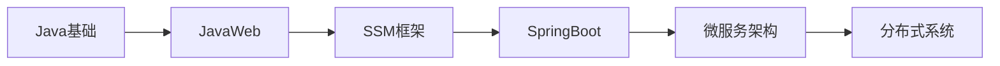

# 🏠 DK_Note 全栈技术知识库

> 从高级语言到底层驱动，从Web开发到嵌入式系统的全栈技术学习记录
## 1 前言

- 相关内容可以看目录

- 伙伴们感觉有用，麻烦点个star呀，你的star是我的更新的动力

- 部分文章也有在部分文章也有在个人小站中摘录中 http://www.dakkk.top（停用）

- 大部分内容来自尚硅谷、黑马、个人报的私教课等

- 有些知识会重复，按需下载哈

- 本项目基于Obsidian编写，通过插件git实时更新内容，需要的小伙伴 **可以拉取整个项目，使用Obsidian打开即可** 

- 仅供参考，复制请注明来源，本文转载请附上原文出处和本声明。

- 关于文件问题，可以联系 mikeylay@126.com

## 2 📚 最近更新文档
- [驱动章节实验环境搭建](06-🐧%20Linux系统/04-🔌%20驱动开发/02-💾%20Lubancat-RK3568/4_Linux驱动开发实战/1_Linux驱动基础知识/1_驱动章节实验环境搭建.md)
- [Linux内核模块](06-🐧%20Linux系统/04-🔌%20驱动开发/02-💾%20Lubancat-RK3568/4_Linux驱动开发实战/1_Linux驱动基础知识/2_Linux内核模块.md)
- [Linux内核模块实验](06-🐧%20Linux系统/04-🔌%20驱动开发/02-💾%20Lubancat-RK3568/4_Linux驱动开发实战/1_Linux驱动基础知识/3_Linux内核模块实验.md)

## 3 🔥 核心技术标签
#进行中 #重要 #Java #C++ #STM32 #Linux驱动 #数据结构 #算法 #嵌入式 #Web开发 #数据库 #分布式

## 4 📁 技术栈导航

### 4.1 📚 知识管理
- [📖 读书笔记](📖%20读书笔记) - 技术书籍深度阅读 
- [[📝 学习笔记]] - 系统化学习记录
- [[💡 思考感悟]] - 技术思考与总结
- [[🔗 资源收藏]] - 优质学习资源

### 4.2 💻 编程语言
- [[☕ Java技术栈]] - 企业级后端开发
- [[🔷 C&C++技术栈]] - 系统级编程语言

### 4.3 🌐 Web开发
- [[🔙 后端技术]] - 服务器端开发技术
- [[🖥️ 前端技术]] - 用户界面开发技术

### 4.4 🗄️ 数据库技术
- [[🐬 MySQL]] - 关系型数据库王者
- [[🔴 Redis]] - 高性能内存数据库
- [[📊 其他数据库]] - 多样化数据存储

### 4.5 🔧 嵌入式开发
- [[🎯 51单片机]] - 8位单片机入门
- [[🚀 32单片机]] - ARM Cortex-M开发
- [[📡 通信协议]] - 硬件通信技术

### 4.6 🐧 Linux系统
- [[⚙️ 系统基础]] - Linux操作与管理
- [[🔌 驱动开发]] - 内核模块与设备驱动
- [[🔧 内核编程]] - 内核级系统编程

### 4.7 📐 计算机基础
- [[🏗️ 数据结构]] - 数据组织的艺术
- [[🧮 算法设计]] - 问题解决的智慧
- [[💾 计算机组成]] - 硬件系统原理
- [[🌐 计算机网络]] - 网络通信协议
- [[🔄 操作系统]] - 系统底层原理

### 4.8 🛠️ 开发工具
- [[💻 IDE工具]] - 集成开发环境
- [[🔧 版本控制]] - Git版本管理
- [[🐋 容器化]] - Docker容器技术
- [[☁️ 运维部署]] - 自动化运维

### 4.9 🔬 中间件技术
- [[📨 消息队列]] - 异步通信中间件
- [[🔍 搜索引擎]] - 全文检索技术
- [[🌐 微服务]] - 分布式系统架构

### 4.10 🚀 项目实战
- [[📝 博客系统]] - 全栈博客开发
- [[⚡ 秒杀系统]] - 高并发系统设计
- [[🔧 嵌入式项目]] - 硬件项目实战
- [[🌐 Web项目]] - Web应用开发
- [[📋 项目模板]] - 快速开发模板

### 4.11 📅 日常记录
- [[📆 每日总结]] - 学习与工作日志
- [[🎯 目标规划]] - 技能提升规划
- [[💼 工作记录]] - 职业发展记录
- [[🏃 个人成长]] - 能力进阶轨迹

## 5 📊 知识库全景统计
- **总文档数**：1000+
- **编程语言**：Java, C/C++
- **技术领域**：Web开发, 嵌入式, Linux驱动, 数据库
- **基础理论**：数据结构, 算法, 计算机组成, 网络, 操作系统
- **实战项目**：博客系统, 秒杀系统, 嵌入式应用
- **开发工具**：IDE, Git, Docker, 运维工具

## 6 🎓 技术学习路径图

### 6.1 🔰 基础夯实路径

### 6.2 🌐 Web全栈路径

### 6.3 🔧 嵌入式系统路径

### 6.4 ⚡ 系统架构路径

## 7 📈 技能成长轨迹

- **编程语言**：Java ⭐⭐⭐⭐ | C++ ⭐⭐⭐ | C ⭐⭐⭐⭐

- **Web开发**：SpringBoot ⭐⭐⭐⭐ | Vue ⭐⭐⭐

- **数据库**：MySQL ⭐⭐⭐⭐ | Redis ⭐⭐⭐

- **嵌入式**：STM32 ⭐⭐⭐ | 51单片机 ⭐⭐⭐⭐

- **系统编程**：Linux ⭐⭐⭐ | 驱动开发 ⭐⭐

- **基础理论**：算法 ⭐⭐⭐ | 网络 ⭐⭐⭐ | 操作系统 ⭐⭐⭐