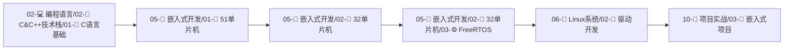

# 🏠 DK_Note 全栈技术知识库

> 从高级语言到底层驱动，从Web开发到嵌入式系统的全栈技术学习记录
## 1 前言

- 相关内容可以看目录

- 伙伴们感觉有用，麻烦点个star呀，你的star是我的更新的动力

- 部分文章也有在部分文章也有在个人小站中摘录中 http://www.dakkk.top（停用）

- 大部分内容来自尚硅谷、黑马、个人报的私教课等

- 有些知识会重复，按需下载哈

- 本项目基于Obsidian编写，通过插件git实时更新内容，需要的小伙伴 **可以拉取整个项目，使用Obsidian打开即可** 

- 仅供参考，复制请注明来源，本文转载请附上原文出处和本声明。

- 关于文件问题，可以联系 mikeylay@126.com

## 2 📚 最近更新文档
- [驱动章节实验环境搭建](06-🐧%20Linux系统/04-🔌%20驱动开发/02-💾%20Lubancat-RK3568/4_Linux驱动开发实战/1_Linux驱动基础知识/1_驱动章节实验环境搭建.md)
- [Linux内核模块](06-🐧%20Linux系统/04-🔌%20驱动开发/02-💾%20Lubancat-RK3568/4_Linux驱动开发实战/1_Linux驱动基础知识/2_Linux内核模块.md)
- [Linux内核模块实验](06-🐧%20Linux系统/04-🔌%20驱动开发/02-💾%20Lubancat-RK3568/4_Linux驱动开发实战/1_Linux驱动基础知识/3_Linux内核模块实验.md)

## 🔥 核心技术标签
#进行中 #重要 #Java #C++ #STM32 #Linux驱动 #数据结构 #算法 #嵌入式 #Web开发 #数据库 #分布式

## 📁 技术栈导航

### 01-📚 知识管理
- [[01-📖 读书笔记]] - 技术书籍深度阅读
- [[02-📝 学习笔记]] - 系统化学习记录
- [[03-💡 思考感悟]] - 技术思考与总结
- [[04-🔗 资源收藏]] - 优质学习资源

### 02-💻 编程语言
- [[01-☕ Java技术栈]] - 企业级后端开发
- [[01-🎯 学习路线]] | [[02-📚 基础语法]] | [[03-🔥 JUC并发]] | [[04-⚡ JVM虚拟机]] | [[05-💡 实用技巧]]
- [[02-🔷 C&C++技术栈]] - 系统级编程语言
- [[01-📖 C语言基础]] | [[02-🎯 C++面向对象]] | [[03-📚 STL标准库]] | [[04-🔧 系统编程]]

### 03-🌐 Web开发
- [[01-🔙 后端技术]] - 服务器端开发技术
- [[01-🌐 JavaWeb]] | [[02-🍃 Spring生态]] | [[03-🚀 SpringBoot]] | [[04-☁️ SpringCloud]] | [[05-📊 MyBatis]] | [[06-🔧 SSM框架]]
- [[02-🖥️ 前端技术]] - 用户界面开发技术
- [[01-📝 HTML&CSS]] | [[02-⚡ JavaScript]] | [[03-💚 Vue框架]] | [[04-⚛️ React框架]]

### 04-🗄️ 数据库技术
- [[01-🐬 MySQL]] - 关系型数据库王者
- [[01-📚 基础语法]] | [[02-🚀 高级特性]] | [[03-⚡ 性能优化]] | [[04-💡 实用技巧]]
- [[02-🔴 Redis]] - 高性能内存数据库
- [[01-📖 基础使用]] | [[02-🎯 高级应用]] | [[03-🎓 训练营笔记]]
- [[03-📊 其他数据库]] - 多样化数据存储

### 05-🔧 嵌入式开发
- [[01-🎯 51单片机]] - 8位单片机入门
- [[01-📚 基础入门]] | [[02-🔌 外设编程]] | [[03-🚀 项目实战]]
- [[02-🚀 32单片机]] - ARM Cortex-M开发
- [[01-📖 STM32基础]] | [[02-🛠️ HAL库开发]] | [[03-⚙️ FreeRTOS]] | [[04-🎯 项目实战]]
- [[03-📡 通信协议]] - 硬件通信技术
- [[01-📱 UART串口]] | [[02-🔄 SPI通信]] | [[03-🔗 IIC通信]] | [[04-🚌 CAN总线]]

### 06-🐧 Linux系统
- [[01-⚙️ 系统基础]] - Linux操作与管理
- [[01-💻 命令行操作]] | [[02-🔧 系统管理]] | [[03-🌐 网络配置]]
- [[02-🔌 驱动开发]] - 内核模块与设备驱动
- [[01-📝 字符设备]] | [[02-💾 块设备]] | [[03-🌐 网络设备]] | [[04-🔧 平台设备]] | [[05-🌳 设备树]]
- [[03-🔧 内核编程]] - 内核级系统编程
- [[01-🧩 内核模块]] | [[02-📞 系统调用]] | [[03-⚡ 中断处理]]

### 07-📐 计算机基础
- [[01-🏗️ 数据结构]] - 数据组织的艺术
- [[01-📊 线性结构]] | [[02-🌳 树形结构]] | [[03-🕸️ 图结构]] | [[04-🗂️ 哈希表]] | [[05-☕ Java实现]]
- [[02-🧮 算法设计]] - 问题解决的智慧
- [[01-🔄 排序算法]] | [[02-🔍 查找算法]] | [[03-📈 动态规划]] | [[04-🎯 贪心算法]] | [[05-🔀 分治算法]] | [[06-↩️ 回溯算法]] | [[07-📝 LeetCode刷题]] | [[08-☕ Java实现]]
- [[03-💾 计算机组成]] - 硬件系统原理
- [[01-🔢 CPU架构]] | [[02-🧠 内存系统]] | [[03-🔌 IO系统]]
- [[04-🌐 计算机网络]] - 网络通信协议
- [[01-📡 TCP&IP]] | [[02-🌐 HTTP协议]] | [[03-🔒 网络安全]]
- [[05-🔄 操作系统]] - 系统底层原理
- [[01-⚙️ 进程管理]] | [[02-🧠 内存管理]] | [[03-📁 文件系统]] | [[04-🔄 同步互斥]]

### 08-🛠️ 开发工具
- [[01-💻 IDE工具]] - 集成开发环境
- [[01-🧠 IntelliJ IDEA]] | [[02-🔷 Visual Studio]] | [[03-📝 VSCode]] | [[04-🌐 WebStorm]] | [[05-🔧 Keil]]
- [[02-🔧 版本控制]] - Git版本管理
- [[01-📚 Git基础]] | [[02-🚀 Git进阶]] | [[03-🌐 GitHub&GitLab]] | [[04-💡 实用技巧]]
- [[03-🐋 容器化]] - Docker容器技术
- [[01-📚 Docker基础]] | [[02-🚀 Docker进阶]] | [[03-☸️ Kubernetes]]
- [[04-☁️ 运维部署]] - 自动化运维
- [[01-🖥️ 服务器配置]] | [[02-🤖 自动化部署]] | [[03-📊 监控告警]]

### 09-🔬 中间件技术
- [[01-📨 消息队列]] - 异步通信中间件
- [[01-🚀 RocketMQ]] | [[02-⚡ Kafka]] | [[03-🐰 RabbitMQ]]
- [[02-🔍 搜索引擎]] - 全文检索技术
- [[01-🔍 Elasticsearch]] | [[02-☀️ Solr]]
- [[03-🌐 微服务]] - 分布式系统架构
- [[01-☁️ SpringCloud]] | [[02-🎯 Dubbo]] | [[03-🚪 服务网关]]

### 10-🚀 项目实战
- [[01-📝 博客系统]] - 全栈博客开发
- [[01-📋 需求分析]] | [[02-🏗️ 技术架构]] | [[03-📝 开发日志]] | [[04-🚀 部署运维]] | [[05-🐛 Bug处理]] | [[06-⚡ 后期优化]]
- [[02-⚡ 秒杀系统]] - 高并发系统设计
- [[01-🏗️ 架构设计]] | [[02-🔒 分布式锁]] | [[03-🚀 性能优化]]
- [[03-🔧 嵌入式项目]] - 硬件项目实战
- [[01-💡 智能硬件]] | [[02-🌐 物联网项目]] | [[03-📡 传感器应用]]
- [[04-🌐 Web项目]] - Web应用开发
- [[01-🚀 SpringBoot项目]] | [[02-🔄 前后端分离]] | [[03-☁️ 微服务项目]]
- [[05-📋 项目模板]] - 快速开发模板
- [[01-☕ Java模板]] | [[02-🔷 C++模板]] | [[03-🔧 嵌入式模板]]

### 11-📅 日常记录
- [[01-📆 每日总结]] - 学习与工作日志
- [[02-🎯 目标规划]] - 技能提升规划
- [[03-💼 工作记录]] - 职业发展记录
- [[04-🏃 个人成长]] - 能力进阶轨迹
- [[05-💰 生活事务]] - 生活管理记录
- [[06-🔧 杂七杂八]] - 临时记录与想法

### 12-🔧 系统配置
- [[01-📋 模板库]] - 常用文档模板
- [[02-🏷️ 标签系统]] - 知识分类体系
- [[03-📊 Dashboard]] - 知识库仪表盘
- [[04-🔗 快速导航]] - 常用链接集合
- [[05-🛠️ Obsidian技巧]] - 工具使用技巧

## 5 📊 知识库全景统计
- **总文档数**：1000+
- **编程语言**：Java, C/C++
- **技术领域**：Web开发, 嵌入式, Linux驱动, 数据库
- **基础理论**：数据结构, 算法, 计算机组成, 网络, 操作系统
- **实战项目**：博客系统, 秒杀系统, 嵌入式应用
- **开发工具**：IDE, Git, Docker, 运维工具

## 6 🎓 技术学习路径图

### 6.1 🔰 基础夯实路径

### 6.2 🌐 Web全栈路径

### 6.3 🔧 嵌入式系统路径

### 6.4 ⚡ 系统架构路径

## 7 📈 技能成长轨迹

- **编程语言**：Java ⭐⭐⭐⭐ | C++ ⭐⭐⭐ | C ⭐⭐⭐⭐

- **Web开发**：SpringBoot ⭐⭐⭐⭐ | Vue ⭐⭐⭐

- **数据库**：MySQL ⭐⭐⭐⭐ | Redis ⭐⭐⭐

- **嵌入式**：STM32 ⭐⭐⭐ | 51单片机 ⭐⭐⭐⭐

- **系统编程**：Linux ⭐⭐⭐ | 驱动开发 ⭐⭐

- **基础理论**：算法 ⭐⭐⭐ | 网络 ⭐⭐⭐ | 操作系统 ⭐⭐⭐

📅 最后更新：{{date}} | 📝 总文档：1000+ | 🔥 持续学习中...